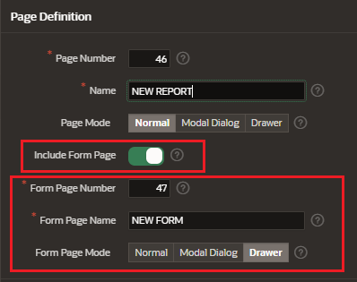

# Forms

Forms are application components that are used to manipulate databaes objects.

You can create forms either manually or by using wizards.

### Form types

- Form
- Interactive Grid
- Master-Detail

## Create Application Wizard

Enter the page details:

- page name, icon
- table of View
- include report

## Create Form as New Page

In the Add Page Dialog, select form

And enter the source information for the report

- Data Source
  - local database
  - rest enabled SQL Service
  - REST data source
- Source Type
  - table
  - SQL Query
- Primary Key
- Branch Pages

## Create Form along with a report

When you create interactive and classic reports you can create automatically the form related to the table of the report.

## Create Form in exisiting page

## Link report to existing forms

You can also link interactive and classic reports to existing forms.

In the report go to the properties > Attributes

Configure Link

- Link Column: Link to Custom Target
- Target:
  - Type: Page in this application
  - Page
- Set Items: to filter by an id
- Clear / Reset
