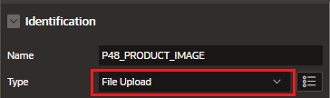
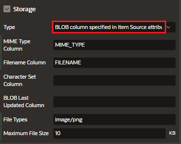
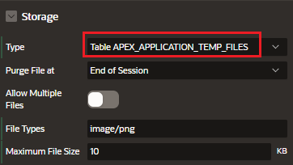
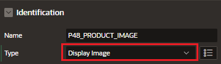
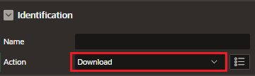
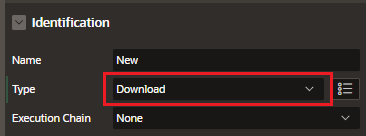

# Blob Columns in Forms

In a Form, any item sourced from a BLOB database column becomes a File Upload Item.

- On INSERT, the selected file is uploaded to the BLOB Column
- ON UPDATE, a download link appears next to the browser button for file access

# Uploading Files

## File Upload Item

The File Upload page item has additional settings to facilitate managing this additional information completely declaratively

### Storage

#### BLOB column specified in Item Source attribute

Stores the uploaded file in the table used by the Automatic Row Processing (DML) process and the column specified in the item source attribute.

The column has to be of data type BLOB.

If the file gets downloaded, the table name of the Automatic Row Fetch process is used.

- Type: BLOB column specified in Item Source attribute
- MIME Type Column
- Filename Column
- Character Set Column
- BLOB Last Updated Column
- File Types
- Maximum File Size

#### APEX_APPLICATION_TEMP_FILES

APEX_APPLICATION_TEMP_FILES stores the uploaded file(s) in a temporary location that you can access with the view APEX_APPLICATION_TEMP_FILES.

Oracle APEX will automatically delete the file(s) at the end of the session or at the end of the upload request, depending on what you choose for Purge File At.

- Type: APEX_APPLICATION_TEMP_FILES
- Purge file at:
  - End of Session
  - End of Request
- Allow Multiple Files
- File Types
- Maximum File Size

## Display Image Item

For BLOB images, use the Display Image item type to show them in a form.

## Download Process

If you have BLOB or CLOB of files in the database, you can trigger the download of these files using the download dynamic action.

Download is also available as a process type.

You can download a single file, or if you have multiple files, you can choose to download them as a zip.

