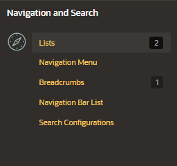

# Navigation

When you build an APEX application, you can include different types of navigation controls.

The available navigation options depend on the application theme.

Common navigation controls are:

### Lists

Shared collection of links

- change appearance of list through list templates
- each list element has a display condition that enables you to control when it displays

### Navigation menu

List of links that enable users to navigate the pages

- supported only in applications using the universal theme

### Breadcrumbs

Provide users with hierarchical navigation

- hierarchical list of links that display using templates
- display as a list of links or as a breadcrumb bar

### Navigation bar list

Entries offer users a simple navigation path for moving between pages

- location of a navigation bar depends on the associated page template - - navigation bar entries can display the links from an Image or a text

### Search configurations

Declarative searches to an application

- search configurations that contain information about a searchable data source
- new component introduced into APEX 22.2

