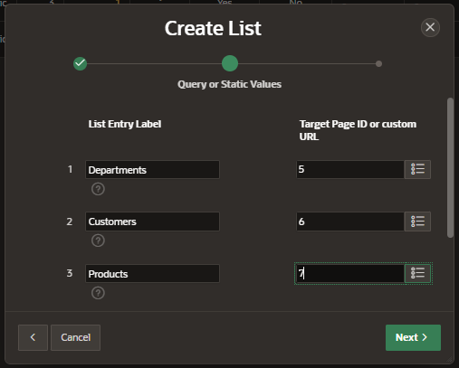

# List

A list is a shared collection of links to a database application.

## Types

- Static: list entry label and a target are defined
  - target can be a page or a URL
  - display condicionts are available
- Dynamic: enables you to dynamically create title list items
  - support mobile frameworks
  - based on SQL query or a PL/SQL function executed at runtime

## Create Static List

In Shared Component, in the Navigation and Search section select "Lists"

Here you can see the list of navigations list of your application.

Click button "Create"

Enter the information for the list and click on "Next"

- Name: enter a name
- Type: select Static

Enter the List entries and the respective Target values

On the Confirm page, specify your template option and click "Create List"

- Create List Regions?
  - Do not create List region(s)
  - Create list region on current page
  - Create list region for each target page

### Add Entries to list

After you create a list, you can add entries to this list.

Navigate to the List page and select the list that we just created and click button "Create List Entries"

- Entry
  - Parent List Entry
  - Image / class
  - List Entry Label
- Target
  - Target Type: Page in this application
  - Page

## Create Dynamic List

In the Creation List Wizard, specify the type Dynamic and click on "Next"

Enter a SQL query or a PL/SQL function that returns a SQL query

On the Confirm page, specify your template option and click "Create List"

Add the list to a page by creating a List region.

- Identification
  - Type: List
- Source - List: Select the list created
  

## Add List to pages

To specify all those pages on which the list regions should be displayed, navigate to the Server Side Condition in the Property Editor.

- Type: Current Page is in comma delimited list
- Pages: enter the pages

