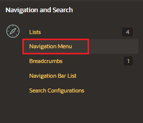
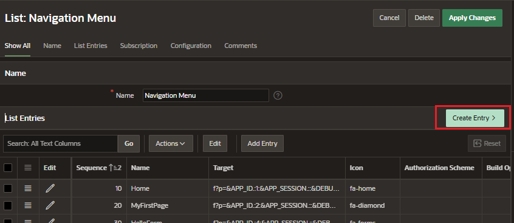

# Navigation Menu

A navigation menu is a list with hierarchical list entries.

- supports the creation of hierarchical submenus
- render at the top of the page as tabs or as a sidebar
- sidebar are responsive

## Create Navigation Menu

In Shared Component, in the Navigation and Search section select "Navigation Menu"

When you create an application, the Create Application Wizard automatically creates the navigation menu.

Enter to the "Navigation Menu" list of your application.

Create new entry

Add new entry, filling the information

- Entry
  - List Entry Label
- Target
  - Target Type: Page in this application
  - Page
