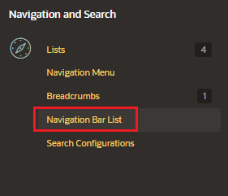
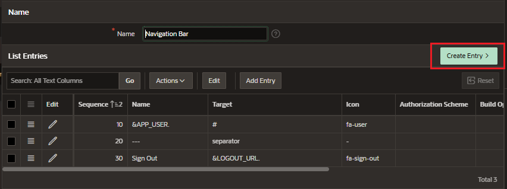

# Navigation Bar List

Navigation bar entries offer an easy way to move users between pages in an application

- navigation bar entry can be an image, text, or an image with text beneath it
- applications can have only one navigation bar
- do not need to reference them on a page-by-page basis
  - If your page template includes the navigation bar substitution string, the Apex engine automatically includes any defined navigation bars when it renders the page

## Create Navigation Bar List

In Shared Component, in the Navigation and Search section select "Navigation Bar List"

The application automatically creates a navigation bar. So accces to it and add a new entry.

Enter the information for the nrew entry

- Entry
  - Parent List Entry
  - Image / class
  - List Entry Label
- Target
  - Target Type: Page in this application
  - Page
