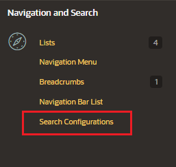
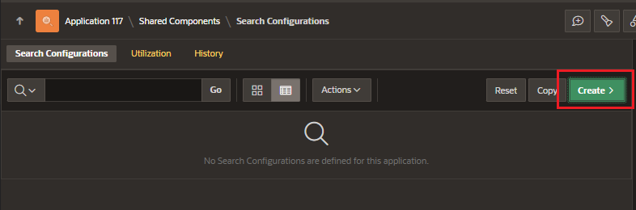
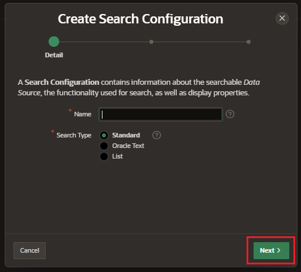
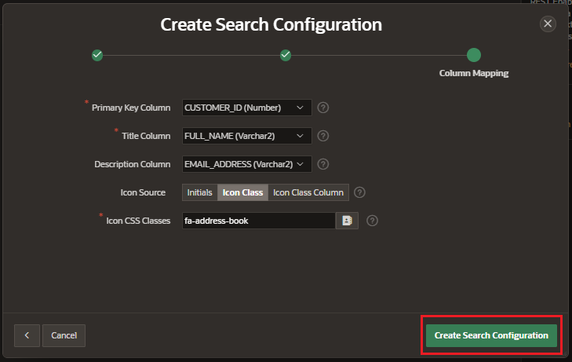
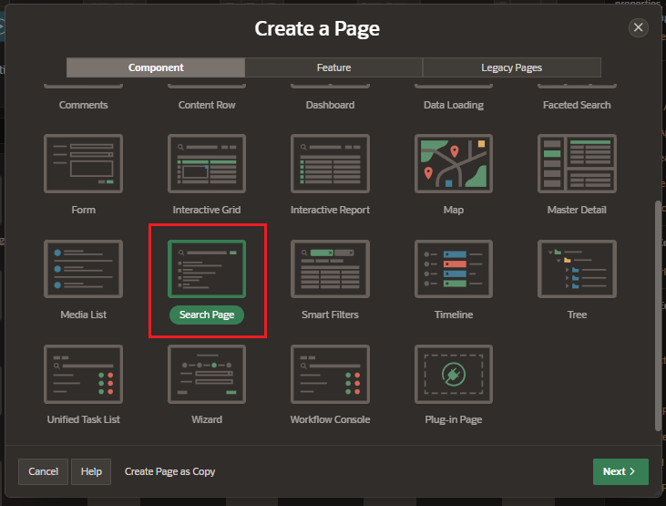
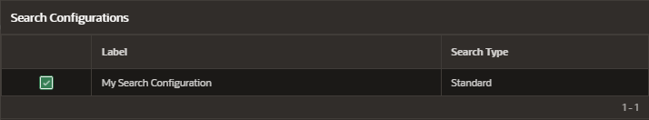

# Search Configuration

Search configurations contain information about a searchable data source.

They can be referenced from search regions to add declarative searches in your application.

Searches can be based on:

- local data source
- REST-enabled SQL service
- REST data source
- predefined Oracle Text
- Oracle APEX list

## Creating Application Searches

Declarative seach can be create for an application by creating:

- search configuration on a data source
- serach page that displays the search result

## Search Configuration

In Shared Component, in the Navigation and Search section select "Search Configurations"

Here you can see the list of Search Configuration of your application.

Click button "Create"

Enter details for the new Search Configuration

- Name
- Search Type

  - Standard
  - Oracle Text
  - List

- Data Source
- Source Type

Enter the column mapping, suggest as primary key, the title column, and the description column. You can even enter an icon source.

## Create Search Page

Create a new page and select the component Search Page

Select the Search Configurations to be used in this page

Click on "Create Page"
