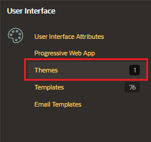
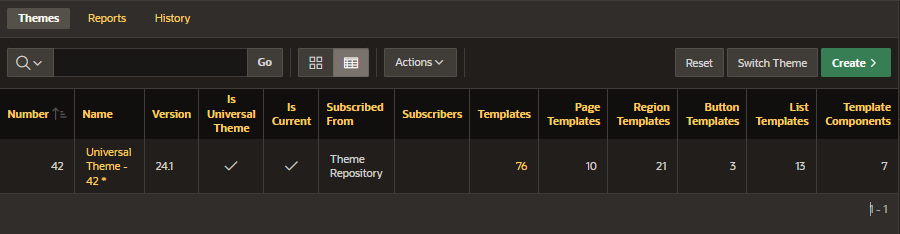
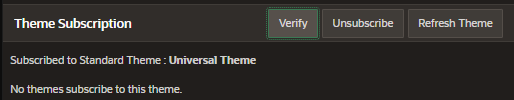
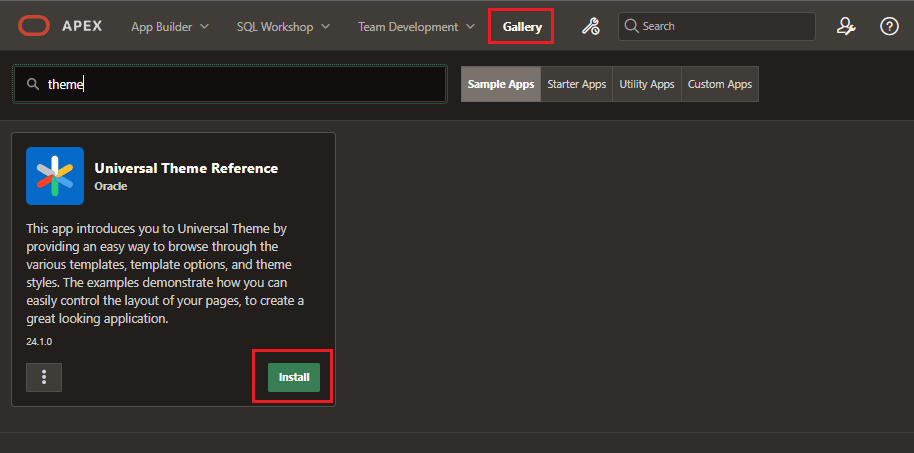
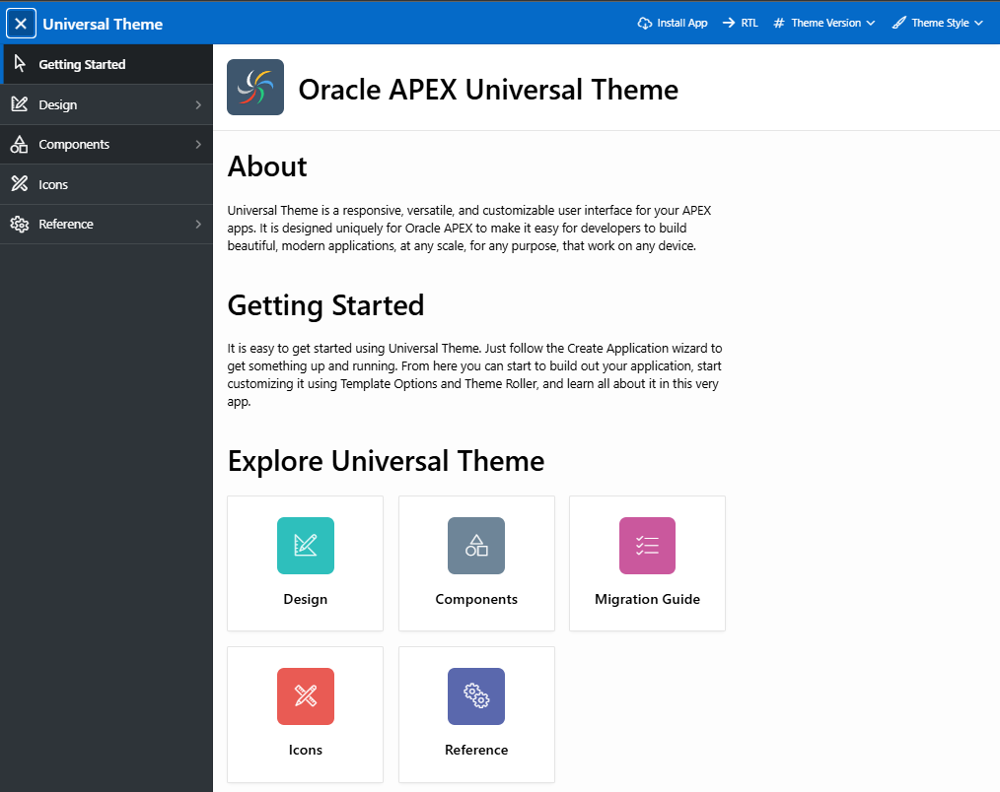

# Themes

A theme is what helps you define the look and feel of your application.

A theme provides you with a set of templates that helps you define the layout and style of an entire application.

## Universal Theme

The Universal Them is the default theme for Oracle APEX applications

- uses responsive HTML5 templates

- uses a 12-column grid layout system to arrange components on a page.

- provides a variety of pre-built theme styles

## Universal Theme Configurations

In Shared Component, under User Interace, select "Themes" to view the list of Themes in the application

Here we can only see the default Universal Theme.

On clicking on the Universal Theme hyperlink, you will be navigated to the Edit Theme page.

### Theme Subscription

Under Theme Subscription, we can see this Theme is currently subscribed to the standard theme.

- Verify button: verify the subscription status
- Unsubscribe: not will be available to refresh Theme
- Refresh Theme: updates from the master Theme into the current Theme

### Set Default Templates

You can define the default component that APEX can use for:

- Component Defaults
- Region Defaults
- Dialog Defaults

### Global Template Options

List of all template options.

### Styles

List of all the predefined theme styles that are shipped with the Universal Theme.

- Current theme style: you can select a current theme

## Universal Theme Reference

To explore and learn more about Universal Theme and different components available in the Universal Theme you can install the sample application from the gallery.

From the Universal Theme Reference application, you can browse through different templates and components available in Universal Theme and icons as well.

