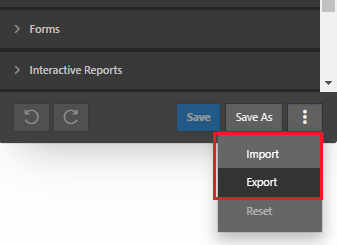

# Theme Styles

A theme style is a CSS style sheet that is added to the base CSS to alter the look and feel of an application

- customize themes
- universal theme includes several pre-built styles
- add styles using Theme Roller utility

## Theme Roller

Theme roller is an ability available in developer toolbar using which you can easily customize the look and feel of your applications.

- modify several style attributes
- see changes applied in real tiem
- allows to save changes as a Theme Style

### Modify styles

You can easily change the color of the applications

### Save changes

You can save the changes an create a Theme Style

The create Theme Styles will appear in the configuration

### Export

You can also export a file with the styles to import in another application

