# Templates

The APEX engine constructs the appearance of each page in an application using Templates

Templates define how pages, page controls, and page components appear

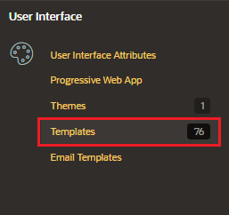

## List of templates

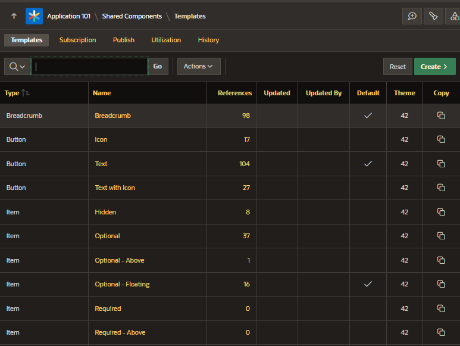

## Create Template

Click on the button "Create" and enter the details

- Template type
- Create Template:
  - From Scratch
  - As a copy of an Existing Template

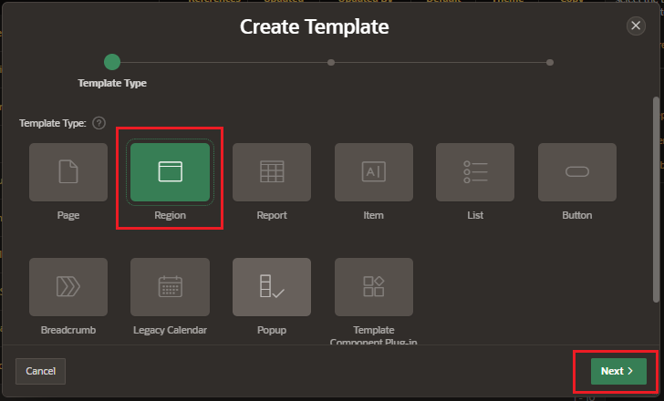

- Name
- Theme: Universal Theme
- Template Class: identify the specific usage of this template

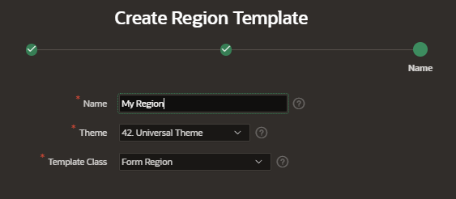

## Edit Custom Template

The new template created is not subscribe to any template from the master Theme and can be editable.

First, you can assign the custom template to a region page

Go to a Page and create a new region and assign the new template

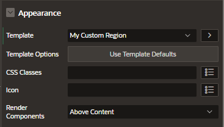

### Definition

You can modificate the HTML of the template

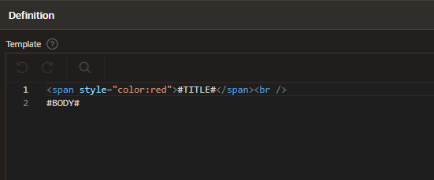

## Template Options

Template options provide a declarative way for developers to apply different styles to components on an application page.

- applying different colors or accents
- applying different spacing and padding
- rendering buttons in different styles
- display form fields with different alignments

### Using Template Options

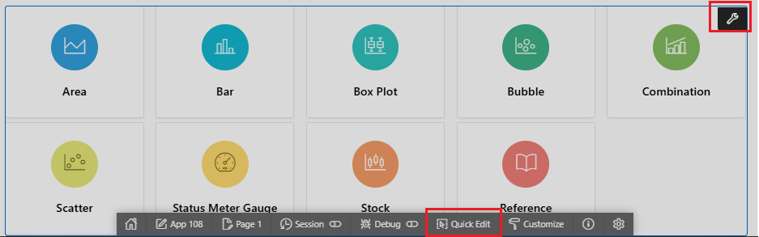

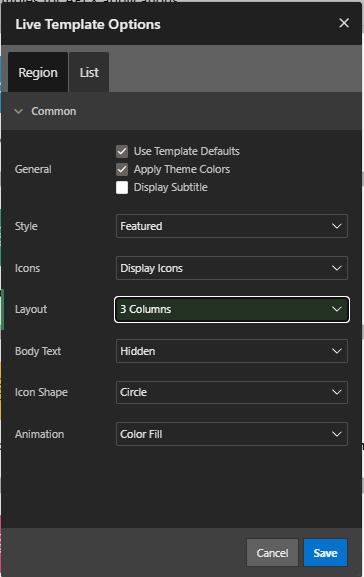

### Creating Template Options

In the Template Edition configuration you can edit or create new options

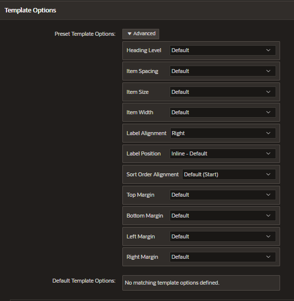

Click on Add Template Option

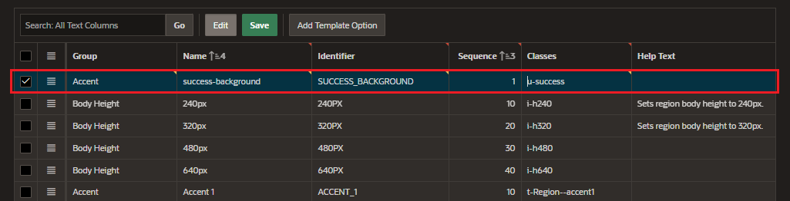

Assign the new template to a region on a page

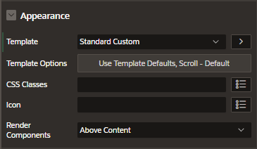

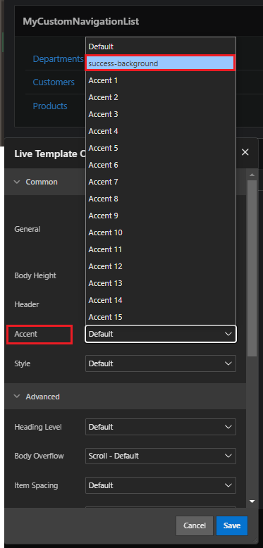
