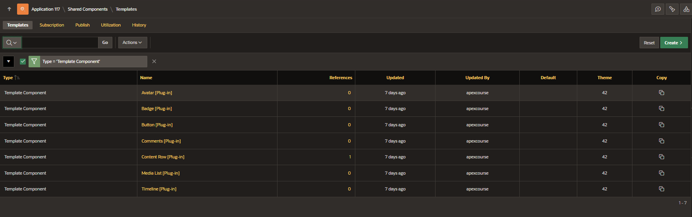
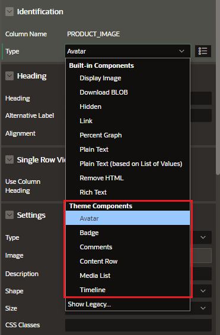
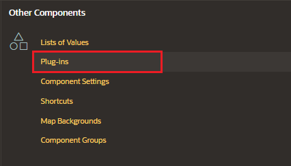
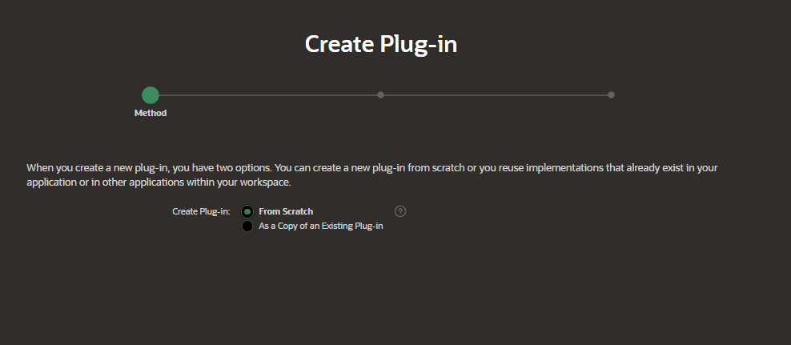

# Template Components

Template Component are a plug-in type for building reusable UI components with support for actions, menus, and custom attributes.

Can be rendered as:

- standalone regions
- partials within reports

With editable attributes for columns or regions in Page Designer.

Supports:

- Action Positions
- Action Templates

You can define row-level conditions for actions and menu buttons.

Enable new regions types not based on PL/SQL, which display single or multiple rows of data and remember pagination.

Can be used in faceted search, smart filters, external Order By items, row selection, and keyboard navigation

Use an HTML template directives to control text processing

## Multiple vs Single vs Region Only

The Available as attribute configures where the Template Component plug-in can be used:

- Multiple (Report): display multiple rows with pagination in a region
- Single (Partial): used for interactive report columns or regions to show a single row
- Region Only: display static values without wrapping HTML

## Using Template Components

Under the Template list, filtering by type, we can see the list of Template Components which we can use in our pages



For example, we can assign to a column of a Interactive Report the Avatar Template Component



## Create Template Component

In Shared Component, in the Other Components section select "Plug-ins"



Click on "Create" button



Enter de details:

### Name

- Name
- Internal name
- Type: Select "Template Component"

### Templates

- Available as:
  - Single (Partial)
  - Multiple (Report)
  - Region only

### Standard Attributes

- Attributes
  - Has Row Selection Support
  - Has Region Template Attribute

### HTML Code

Fill the following attributes with the code for the Template Component

- Partial

```html

<div class="c-overlay"></div>
<div class="action c-top-right-1">#TOP_RIGHT_FIRST#</div>
<div class="action c-top-right-2">#TOP_RIGHT_SECOND#</div>
{if USER_IMAGE/}
<div class="action c-bottom-left">
  {with/} SHAPE:=t=Avatar--circle IMAGE:=#USER_IMAGE# LINK:=#USER_LINK#
  LINK_ATTR:=target="_blank" {apply THEME$AVATAR/} #USER_NAME#
</div>
{endif/}
<div class=""></div>
```

- Report Row

```html
<div #APEX$ROW_IDENTIFICATION#>#APEX$PARTIAL#</div>
```

- Report Body

```html
<mansonry-layout>#APEX$ROWS#</mansonry-layout>
```

### Custom Attributes

Define custom attributes that will be substitute in the HTML markup

- description
- image
- user name
- user link
- user image

### Actions Position

Define attribute groups that will be substitute in the HTML markup

- TOP_RIGHT_FIRST
- TOP_RIGHT_SECOND
