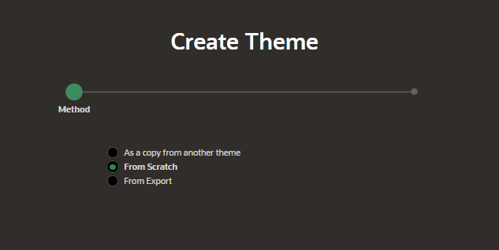
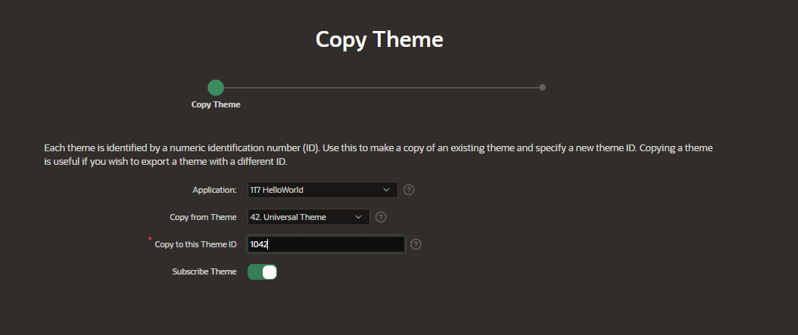
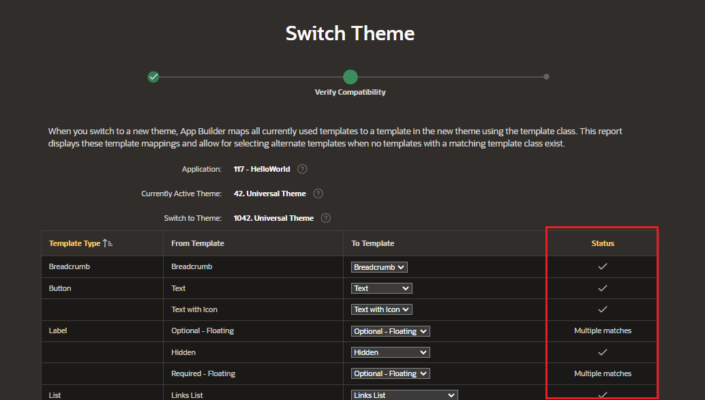

# Manage Themes and Subscriptions

In real-world scenarios, you may be dealing with more than one APEX application.
Then it becomes important to make sure that themes and templates in these applications are in sync.

We can use the subscription model in APEX to do this.

- Subscribing to a master theme enables the theme to be upgraded during future Oracle APEX releases
- Once an application subscribes to a master theme
  - only the default templates can be changed
  - theme attributes, subscribed template options, and subscribed templates are set to read-only

## Create Theme

You can create a theme from the Themes page. Here you can find the Create button. Click on the Create button

Enter the details for the Theme

- Theme Number
- Name
- Identifier
- Navigation Type
- Navigation Bar Implementation

Click on "Create"

## Copy Theme

You can copy a theme from the Themes page by selectin the option As a copy from another theme.

Enter the details for the Theme

- Copy from Theme
- Copy to this Theme ID
- Subscribe Theme

Click on "Copy Theme"

## Switch Theme

To switch to a different theme, you can use the Switch Theme button.

You will be presented with an opportunity to verify the compatibility.

Click on "Switch Theme"
