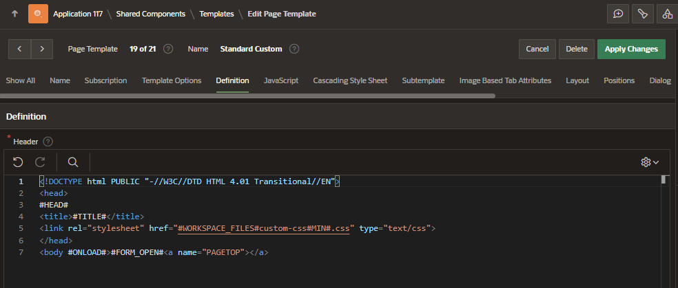

# Custom CSS

You can consolidate all your CSS styles into a single CSS file and upload them to static application files or static workspace files and then reference them wherever you want.

In Shared Component, in the Files and Reports section select:

- Static Application files: accessible across different pages and different components
- Static Workspace files: accessible across different applications

## Create Static Workspace file

In Shared Component, in the Files and Reports section select Static Application files and click on Create button

Once the file is created we have the following information

- Reference: reference of the css file

## Assign CSS file to template

Go to the template where you want to use the Custom CSS and copy the reference of the static workspace file as a link in the header section.

