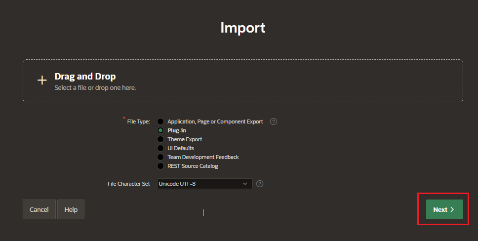
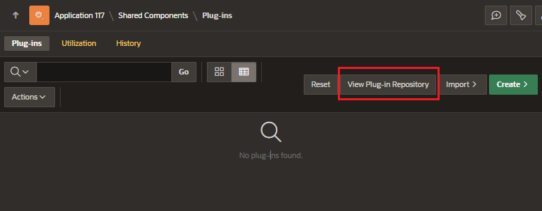

# Plug-in

A plug-in is an extension to the built-in types of APEX.

Enable developers to create highly customized components to enhance the functionality, appearance, and user-friendliness of their applications.

## Import Plug-ins

In Shared Components, under Other Components click on Plug-in

Click on Import button and drop the file with to import

Enter the installation details

- Install Into Application

And click Install Plug-in

## Plug-in Repository

The plug-in repository provides a central location where developers can share and download plug-ins.

