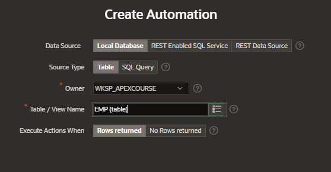

# Automations

Automations are a sequential set of actions, triggered by query results that monitor data and then perform the appropiate action

- create automations to monitor data and then perform the appropiate action
- execute as a query or a PL/SQL function based on a defined schedule
- supports data sources, local database, rest enables SQL Service or REST Data source

## Create Automation

In Shared Components, under Workflows and Automation click on Automations

Click on Create and enter the details

- Name
- Type
  - On demand
  - Scheduled
- Actions Initiated on
  - Query
  - Always
- Execution Schedule
  - Every 15 minutes
  - On the hour
  - Daily at Midnigth
  - Custom
    - Frequency
    - Interval
    - Execution minute

Enter the data source details

Click on Create button

## Add Action to an Automation

Go to actions and click on Create

Add a condition when the action should be executed

