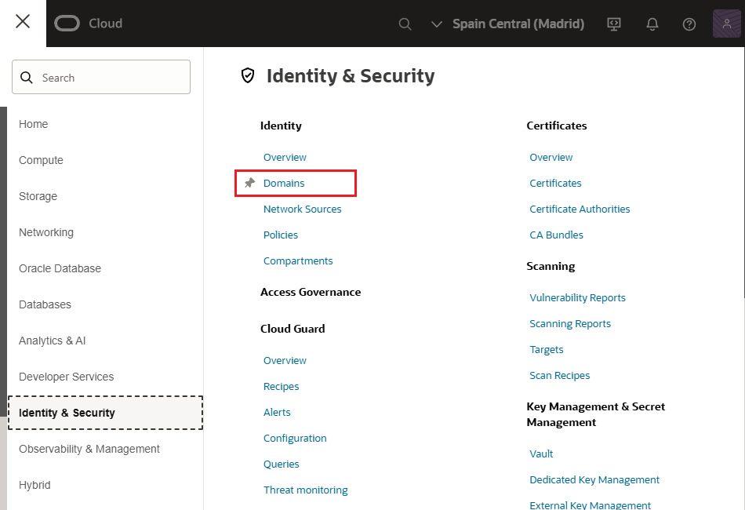
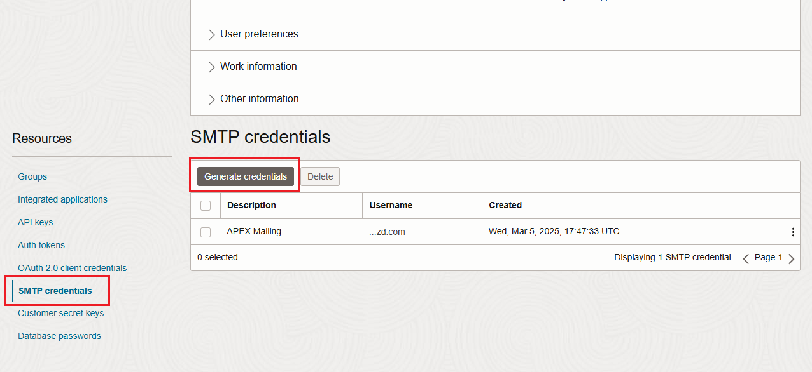

# Configuration

Follow these steps to configure your application to send emails:

- Generating Simple Mail Transfer Protocol (SMTP) Credentials for Email delivery
- Creating an approved sender for Email delivery
- Configurating the SMTP parameters in the Application Express instance
- Sending a test email using Oracle Apex SQL Workshop

### Generating Simple Mail Transfer Protocol (SMTP) Credentials

- Log in the Oracle Cloud website: https://cloud.oracle.com/
- Menu > Identity & Security > Domain



- Enter to the Default domain
- Users > Select the user you want to create SMTP credentials for
- Go to Resources > SMTP Credentials (menu left bottom)



- Click on Generate Credentials
- Copy the Credentials Generated

### Creating an approved sender for Email delivery

- Menu > Developer Services > Application Integration > Email Delivery
- Enter to Approved Senders
- Click Create Approved Sender
- Enter email and click on Create Approved Sender

### Configurating the SMTP parameters in the Application Express instance

- Menu > Developer Services > Application Integration > Email Delivery
- Enter to Configuration
- Copy the MTP Sending Information
  - Public Endpoint: smtp.email.eu-madrid-1.oci.oraclecloud.com
- Menu > Oracle Database > Autonomous Database
- Log in the workspace as ADMIN
- Manage Instances > Instance Settings
- In Email Tab, enter the following:
  - SMTP Host Address: smtp.email.eu-madrid-1.oci.oraclecloud.com
  - SMTP Authentication Username
  - SMTP Password
  - Confirm SMTP Password
- Click on Apply Changes

### Sending a test email using Oracle Apex SQL Workshop

- SQL Workshop > SQL Command
- Execute

```
BEGIN
    APEX_MAIL.send(
        p_from=> <EMAIL>,
        p_to=> <EMAIL>,
        p_subj=> 'Email from Autonomous',
        p_body=> 'This is a test email from Autonomous'
    );

    APEX_MAIL.push_queue();
END;
```

## Enable Network Services

You need to enable network services to send Outbound mail in Oracle.

By default, the ability to interact with network services is disabled in Oracle Database 11g Release 2 or later.

If you are running Oracle APEX with Oracle Database 11g Release 2 o later, you must use the new DBMS_NETWORK_ACL_ADMIN package to grant privileges to any host for the APEX_220200 database user.

Failing to grant these privileges results in issues with the following:

- Sending outbound mail in Oracle APEX
- Users can call methods from the APEX_MAIL package, but issues arise when sending outbound emails
