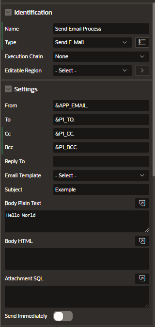

## Sending Emails from APEX on OCI

To send emails from APEX on OCI you can use the APEX_MAIL package, a PL/SQL API to send emails from Oracle APEX Applications deployed in Autonomous Database.

Currently, the only supported email provider is the OCI Email Delivery Service.

## Example

Example of process of type Send E-mail

- Identification
  - Name
  - Type Send E-Mail
- Settings
  - From, to, cc, subject
  - Email Template

