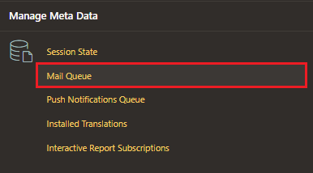
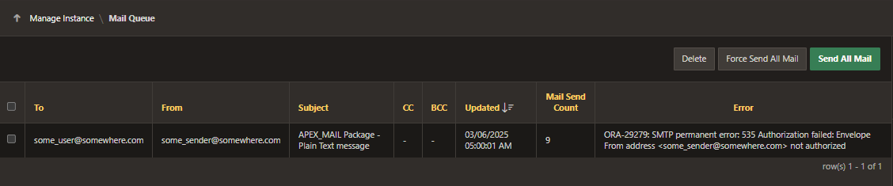

# Mail Queue

When you submit a mail using the APEX_MAIL PL/SQL or any other mailing services available within APEX, the mails are not sent immediately.

The mails are first added to a mail queue, which are then processed by a separate database job which runs every five minutes.

Instance administrators can manage email sent from applications by monitoring email messages in the mail queue and mail log.

- push message
- delete message
- reset message

## Access

- Log in as Admin
- Manage Instance > Manage Meta Data > Mail Queue

## Manage Mail Queue

We can manage the mails in the queue by:

- deleting mails
- force and send all mail
  - ignore calculated delay for the mails which encounter error
- send all mails
  - considering the calculated delayed messages which encounter data

