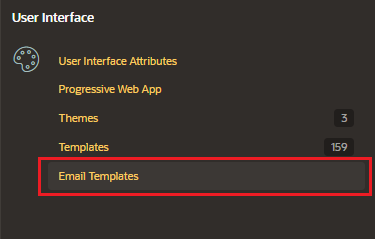
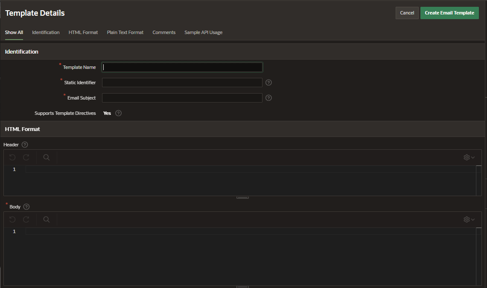

# Email Template

To crete an Email Template go to Shared Component, under User Interface click on Email Templates

Click on "Create Email Template"

Enter the following details:

- Identification
  - Template Name
  - Static Identifier
  - Email Subject
- HTML Format

  - Header
  - Body
  - Footer

- Sample API Usage

Click on Create Email Template
