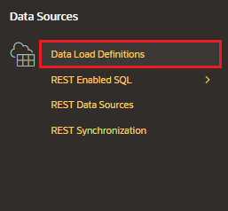
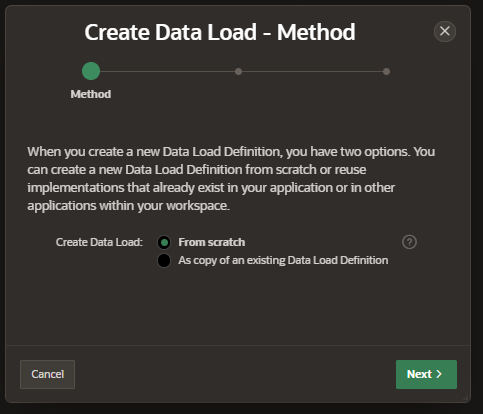
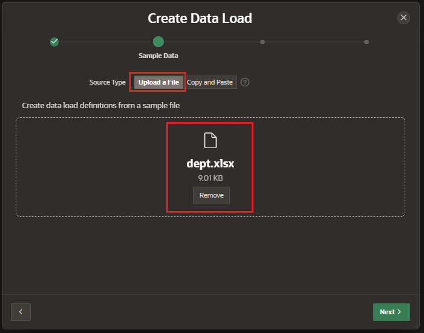
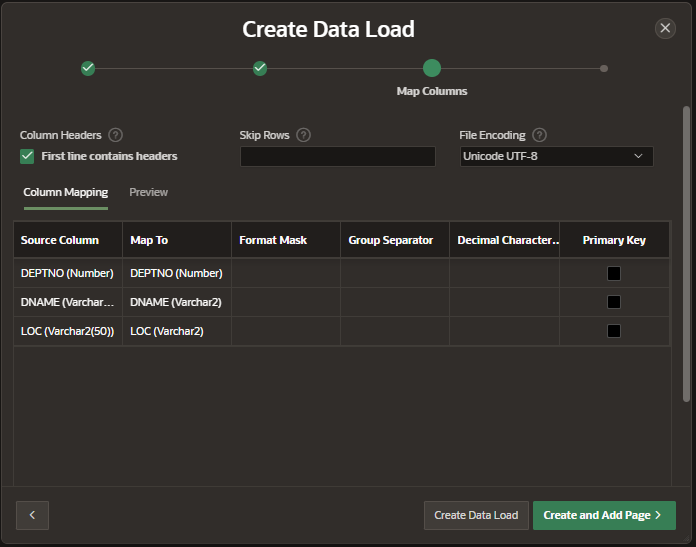
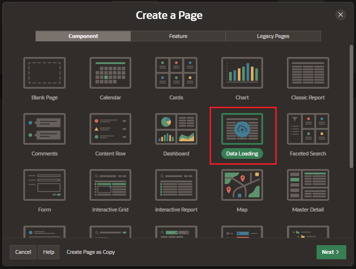
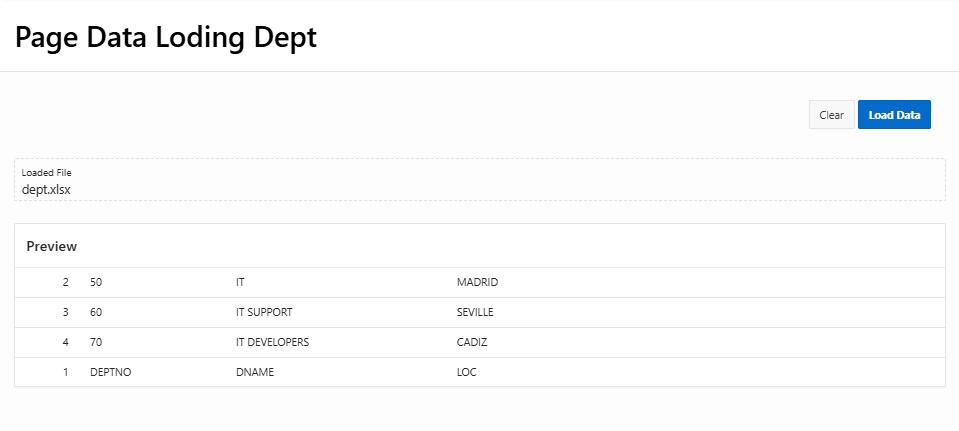

# Data Load Definition

Using Data Load Definition, you can Data Loading capability to an application.

Using Data Load Definition is composed of:

- Data Load Definition
- Data Profile
- Data Profile Columns

### Feautes

- supports CSV, XLSX, XML and JSON formats
- column mapping occurs at design time, removing the burden for end users
- flexible column mappings based on simple names or regular expressions
- data conversion with transformation rules or lookup queries
- easy workflow: upload, verify and load
- configure data loading to Append, Merge or Replace Data, with or without Error Handeling
- simple new process type Data loading
- APEX_DATA_LOADING PL/SQL available for custom processing
- maximum number of columns to load is 300

## Create Data Load

In Shared Components, under Data Sources click on Data Load Definitions

Click on "Create" button

### Target

- Name
- Target Type:
  - Table
  - Collection
- Table Owner
- Table Name

### Sample Data

Load the file in a supported format: CSV, XLSX, XML or JSON

### Map Columns

It will read the columns present in that file and automatically map the columns.

Click on:

- Create Data Load: create a data load definition

- Create and Add Page: create a data load definition and create a data load page

## Create Data Load Page

Create a new page and select the component Data Loading Page

### Page Definition

Enter the details

- Page Number
- Name
- Page Mode

### Data Load Attributes

- Data Load: enter the create Data Load Definition
- Upload Data From:
  - File
  - Paste delimited Data
  - Maximum File Size (MB)

## Example

##
