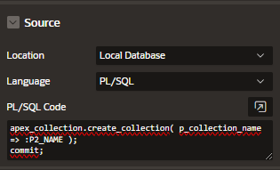

# Collections

Collections enable you to store rows and columns currently in session state.

Can be accessed, manipulated, or processed during a user's sesison

Each Collection contains a named list of data elements, which can have:

- 50 character attributes
- 5 number attributes
- 5 data attributes
- 1 XML attribute
- 1 blob attribute
- 1 clob attributes

## Create Collections

Use the following code to create a collection in APEX

```sql
apex_collection.create_collection( p_collection_name => :P2_NAME );
```

Add it to a page item process



## Add Member to collections

Use the following code to add member to a collection in APEX

```sql
apex_collection.add_member(
    p_collection_name => :P3_NAME,
    p_c001            => :P3_ATTR1,
    p_c002            => :P3_ATTR2,
    p_c003            => :P3_ATTR3,
    p_c004            => :P3_ATTR4,
    p_c005            => :P3_ATTR5,
    p_n001            => :P3_NUM_ATTR1,
    p_n002            => :P3_NUM_ATTR2,
    p_n003            => :P3_NUM_ATTR3,
    p_d001            => to_date(:P3_DATE_ATTR1),
    p_d002            => to_date(:P3_DATE_ATTR2),
    p_d003            => to_date(:P3_DATE_ATTR3),
    p_generate_md5    => 'YES' );
```

## Display collections

You can create a report using as Data Source the collections created

```sql
select * from apex_collections;
```
