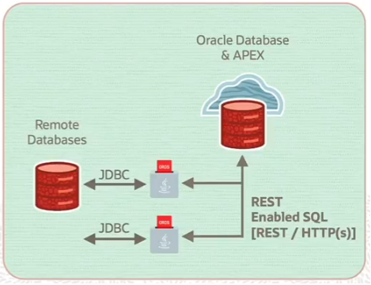
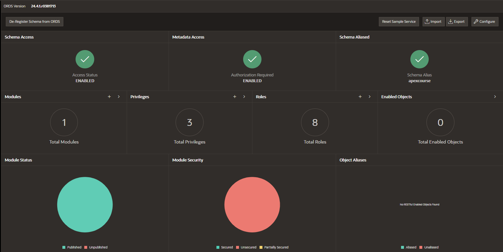
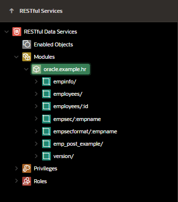
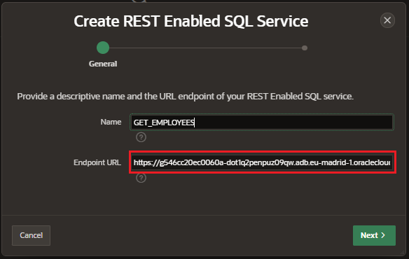
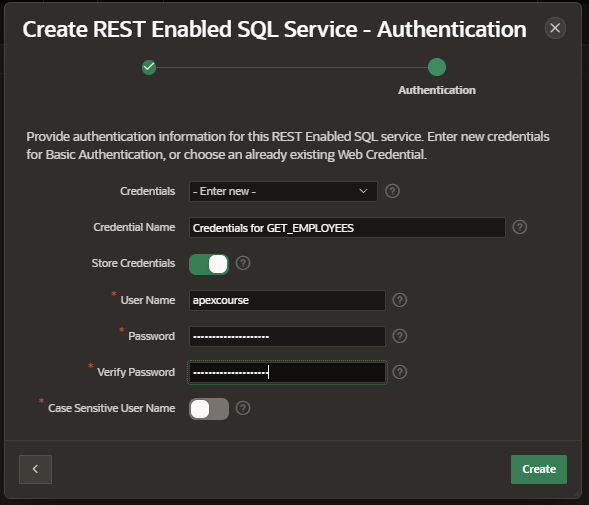
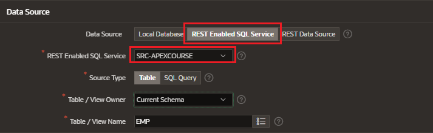

# REST Enabled SQL References

REST Enabled SQL References help you to execute SQL or PL/SQL defined on a remote Oracle Database.

- Developers create REST Enabled SQL References by defining:

  - name
  - endpoint URL
  - authentication information

- APEX passes the SQL or PL/SQL query to ORDS over REST

- JSON response is returned that contains:
  - result set medata
  - result data
  - pagination details

## Requirements

Complete the following requirements before creating a REST Enabled SQL Reference

- Set up a remote Oracle Database
- On the remote Oracle Database, install Oracle REST Data Services (ORDS) 19x or later
- Configure and enable the REST Enabled SQL service feature
- Activate REST Enable SQL for the target schema on the remote database to be accessed by running ORDS.ENABLE_SCHEMA
- The REST Enabled SQL Service is then available with a URL in the following format:
  - http://host:port/ords/schema

## Enable REST-Enable SQL

Enable REST-Enable SQL on your source Oracle remote database.

- SQL Workshop > RESTful Services
- Click on Register Schema with ORDS
- ORDS Schema Attributes
  - Schema Alias
  - Install Sample Servies: enabled
  - Authorization Required for Metadata Access: enabled
- Click Save Schema Attributes

## Configure REST Enabled SQL Service

We can use as endpoint any of the HR sample services:

- App Builder > Workspace Utilities > REST Enabled SQL Services
- Click on Create and enter the details
  - name
  - endpoint: enter endpoint till the schema

- Create a authorization credentials
  - Credential Name
  - Store Credentials: enables
  - Username
  - Password

## Consume REST Enable SQL Service

Create an Interactive Report Page

