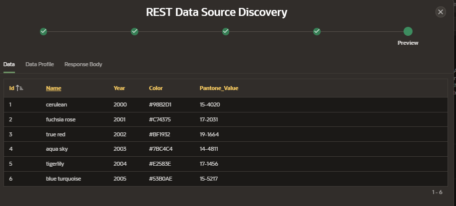

# REST Data Source

REST Data Sources enable developers access to REST services, or generic JSON data feeds in applications.

A REST Data Source can contain one or many operations which are the references to a concrete external web service.

Oracle APEX provides direct integration of REST Data Sources in classic reports, interactive reports, CSS Calendar, and JET Charts

## Create Remote Server

To create a Remote Server navigate to:

- App Builder > Workspaces Utilities > Remote Server
- Click on Create button
- Enter details
  - Name
  - Server Type
    - REST Data Source
  - Endpoint URL

## Create REST Data Source

To create a REST data source navigate to Shared Components, under Data Sources click on REST Data Sources

Click on Create button and select the option From Scratch

Enter the following details:

- REST Data Source Type: Simple HTTP
- Name
- URL Endpoint: https://reqres.in/api/users

The following URL settings should be automatically filled

- Remote server: reqres.in
- Base URL: https://reqres.in/
- Service URL Path: /api/users

Setting pagination

- Pagination Type

Authentication, click on Discover

- Authentication Required

On the confirm tab, Click on Create REST Data Source

## Consuming REST Data Source

Create an Interactive Report Page

