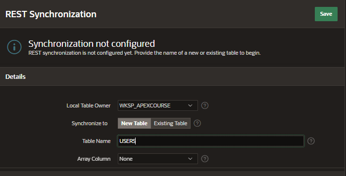
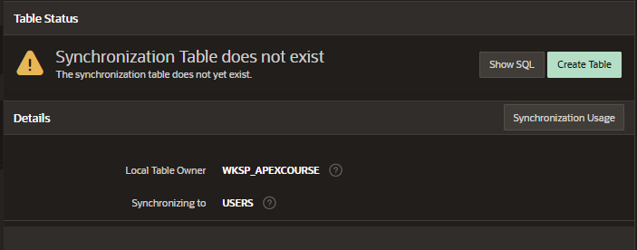
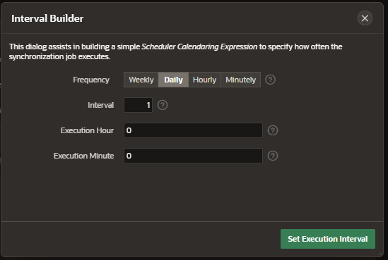

# Data Synchronization

Data Synchronization enables developers to automatically sync the contents of a local table with the data from a REST service.

### Use Cases

- Providing efficient reporting on large data sets coming from a REST service

- Collect data from REST services for consumption by PL/SQL package or other logic

- Collect data from a REST API over a longer period

- Use Intelligent caching for APEX components

## Configure REST Data Syncronization

- Shared Components > REST Data Sources
- Select a REST Data Source and click to edit
- Manage Synchronization on the ritght navigate menu

  - Local Table Owner: select your schema
  - Synchronize to:
    - New Table
    - Existing Table
  - Table Name
  - Nested Rows

- Click on Create Table if it is not created

- Set the Interval Builder details in the Synchronization Schedule settings

Click on Save an Run
