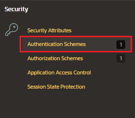
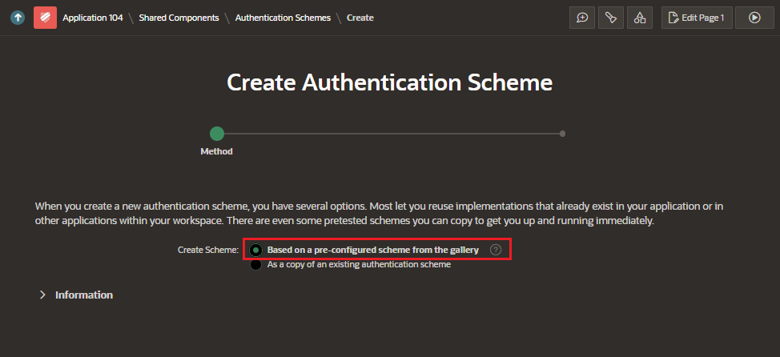
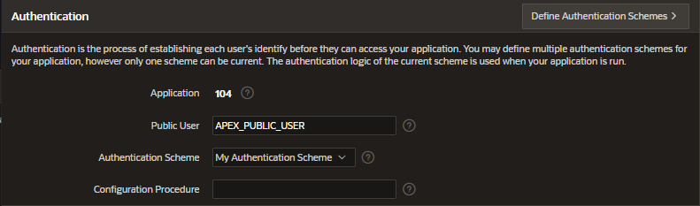

# Authentication

Authentication is the process of establishing each user's identity before they can access your application.

APEX engine uses APP_USER to track user's login name in session state

## Authentication Methods

- built-in authentication scheme
- custom authentication scheme
- not require authentication

## Preconfigured Authentication Schemes

Oracle supports the following preconfigured authentication schemes

- Oracle APEX Accounts
- Custom Authentication
- Database Accounts
- HTTP Header Variables
- Open Door Credentials
- No Authentication
- LDAP Directory
- Oracle Application Server Single Sign-On Server
- SAML Sign-In
- Social Sign-In

## Create Authentication Scheme

In Shared Components, under Security section, click on Authentication Schemes

Click on Create and follow the wizard

- Create Schema: Based on a pre-configured scheme of the gallery
- Name
- Schema Type: the attributes to fill will depend on type selected

Click on Create Schema button

## Apply Authentication Scheme

In Authentication, set the Authentication Scheme
