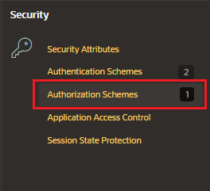
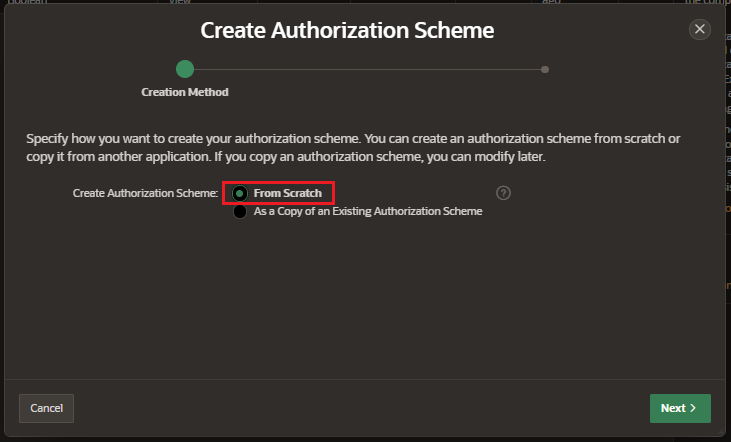
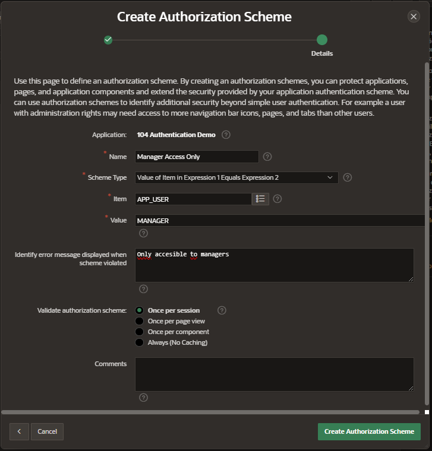
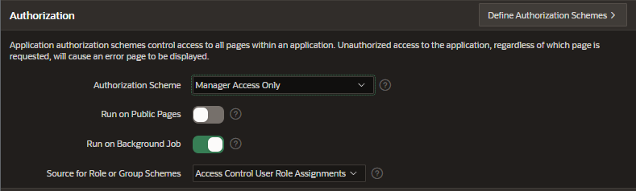
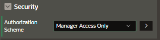

# Authorization

Authorization involves controlling access to resources based on user privileges.

Use authorization schemes to implement authorization in an application.

Authorization scheme can be applied to:

- application
- page
- region, item or buttom

## Create Authorization Schemes

In Shared Components, under Security section, click on Authorization Schemes

Click on Create and follow the wizard

- Create Schema: From Scratch
- Name
- Schema Type: the attributes to fill will depend on type selected

Click on Create Authorization Schema button

## Apply Authorization Scheme

### Login Level

In Shared Components, under Security section, click on Security Attributes

In Authorization, set the Authorization Scheme. This will affect the application login

## Component Level

We can apply an Authorization Scheme to a region or item

