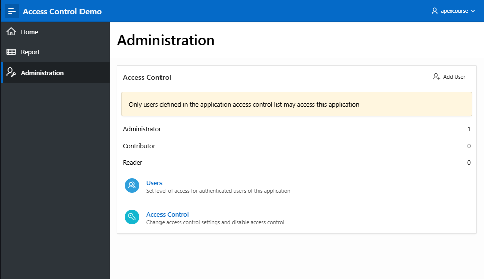

# Access Control Administration Page

You control access to an app, individual page, or page components by creating an access control list.

When you run the Access Control Wizard, it creates multiple pages and the following components:

- Adds an Access Control region to the Administration Page you specify
- Creates access roles:
  - Administrator Rights
  - Contributor
  - Reader
- Creates authorization schemes:
  - Administration Rights
  - Contribution Rights
  - Reader Rights
- Creates the build option, Feature: Access Control
- Creates the Application Setting, ACCESS_CONTROL_SCOPE

You use the access control list to associate the access roles with application users.

## Create Access Control Administration Page

When creating a new application select the Feautres Access Control

### Pages Created

The following pages will be created

- 10000 - Administration
- 10010 - Configure Access Control
- 10011 - Manage User Access
- 10012 - Manage User Access
- 10013 - Add Multiple Users
- 10014 - Add Multiple Users

### Roles

The following Roles will be created

- Administrator
- Contributo
- Reader

### Authorization Schemes

The following Authorization Schemes will be created

- Administrator Rights
- Contributo Rights
- Reader Rights

## Using Access Control Administration Page

### Add Users

