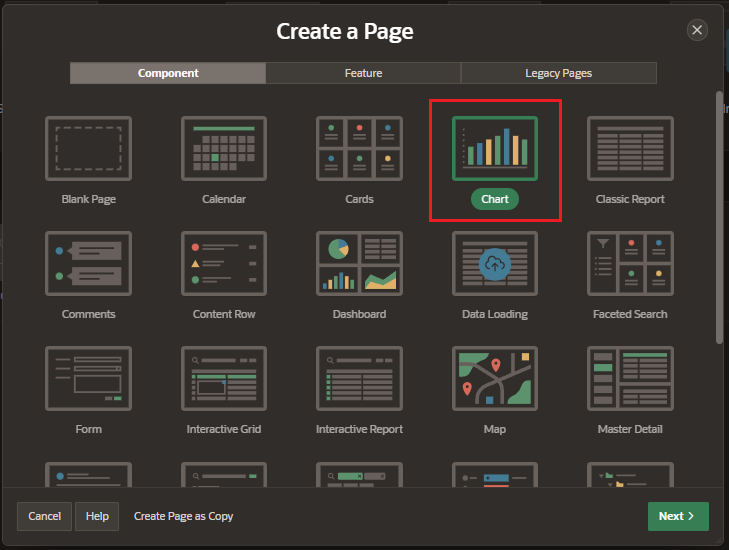
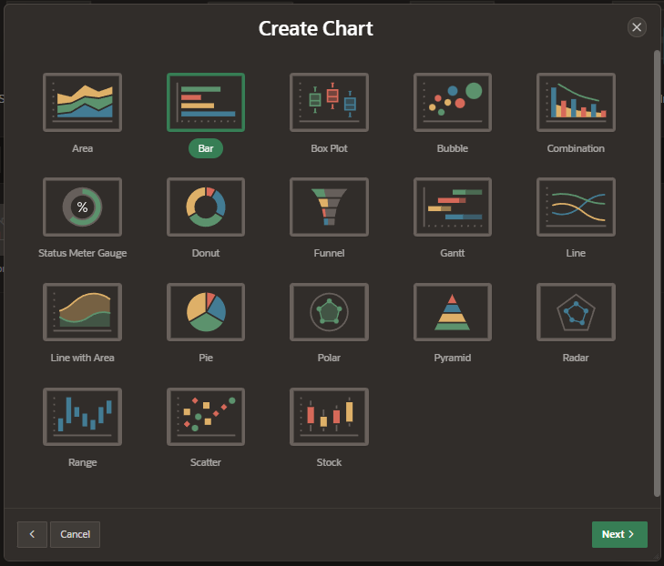
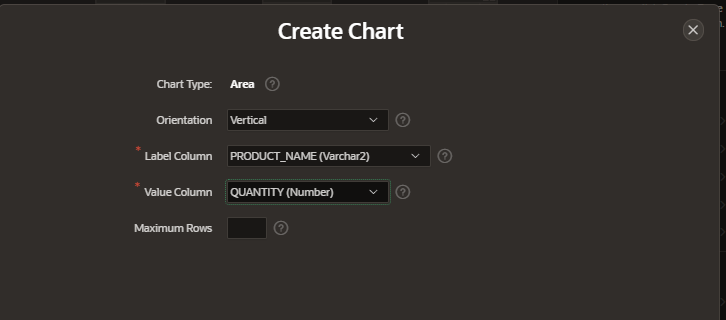
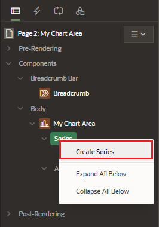

# Charts

You can add a chart to your application by running a built-in wizard or by creating it manually in Page Designer.

## Create Area Charts

Create a new page and select the component Charts

Select a Type of Chart from the list

Enter the page details:

- Pagination

  - page number
  - name
  - page mode

- Data Source;
  - table of View
  - Table / SQL Query

Enter de Charts details:

- Chart Type: Area
- Orientation:
  - Vertical
  - Horizontal
- Label Column
- Value Column

## Add Series

In the Rendering Tree, add a new series in the Chart

Fill the properties:

- Identification
- Source
- Column Mapping

## Attributes

### Appearance

- Orientation
  - Vertical
  - Horizontal
- Stack: to stack the charts one on top of other

### Legend

- Show
- Title
- Position
