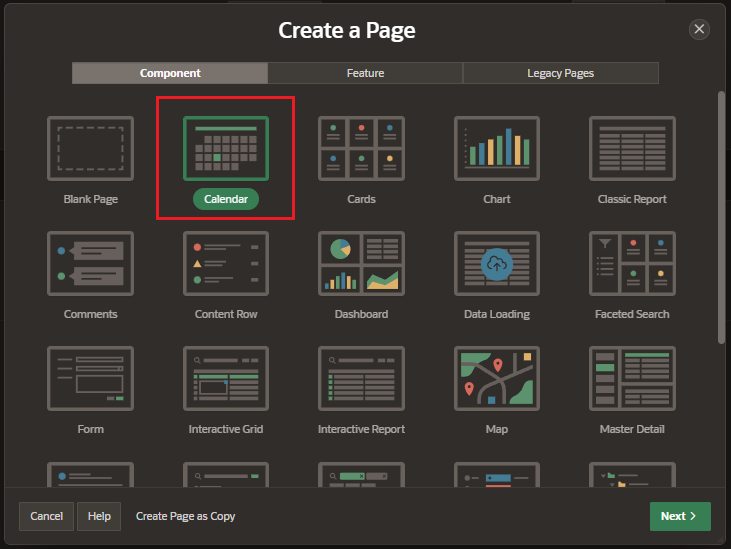
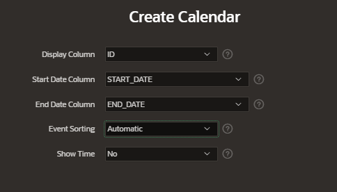

# Calendars

Oracle APEX has an integrated calendarring component.

- based on a tabla or SQL Query
- drag and drop events available

## Create Calendar

Create a new page and select the component Calendar



Enter the page details:

- Pagination

  - page number
  - name
  - page mode

- Data Source;
  - table of View
  - Table / SQL Query

Enter de Calendar details:

- Display Column: ID
- Start Date Column
- End Date Column
- Show T



## Attributes

### Settings

- Display Column
- Start Date Column
- End Date Column
- Primary Key Column

- Drag and Drop:

  - PL/SQL Code: enter the code to manage action of drag and drop
    - `APEX$NEW_START_DATE`: bind variable to get the new start date
    - `APEX$NEW_END_DATE`: bind variable to get the new end date
    - `APEX$PK_VALUE`: bind variable to get the pk

The primary key value of the task is available via the APEX$PK_VALUE bind variable.

    ```sql
    BEGIN
        UPDATE EBA_PROJECT_TASKS
        SET start_date = TO_DATE(:APEX$NEW_START_DATE, 'YYYYMMDD24MISS'),
             end_date = TO_DATE(NVL(:APEX$NEW_END_DATE,:APEX$NEW_START_DATE), 'YYYYMMDD24MISS')
        WHERE id = :APEX$PK_VALUE;
    END;
    ```
