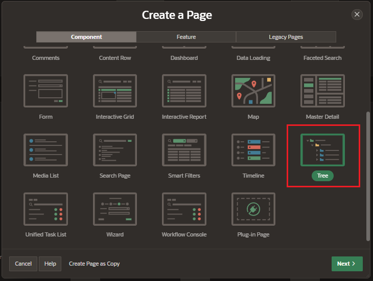
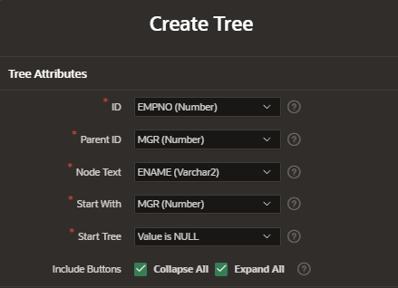

# Trees

A tree is a hierarchical navigation mechanism.

A tree is based on a query and returns data that can be represented in a hierarchy.

A start with .. connect by clause will be used to generate the hierarchical query for your tree.

## Create Tree



Enter the page details:

- Pagination

  - page number
  - name
  - page mode

- Data Source;
  - table of View

### Tree Attributes

Use this page to identify the column you want to use as the ID, the Parent ID, and text that should appear on the nodes. The Start With column will be used to specify the root of the hierarchical query, and its value can be based on an existing item, static value or SQL query returning a single value.

- ID
- Parent ID
- Node Test: root of the hierarchical query
- Start With
- Start Tree
- Include buttons
  - Collapse All
  - Expand All



## Attributes

### Data Source

- SQL Query: the query will be automatically generated

  ```sql
  select case when connect_by_isleaf = 1 then 0
          when level = 1             then 1
          else                           -1
      end as status,
      level,
      "ENAME" as title,
      null as icon,
      "EMPNO" as value,
      null as tooltip,
      null as link
  from "#OWNER#"."EMP"
  start with "MGR" is null
  connect by prior "EMPNO" = "MGR"
  order siblings by "ENAME"
  ```

## Link nodes to pages

In the SQL Query of the Data Source, enter this line in the LINK column with the following parameters:

- p_page: destination page of the link
- p_items: column that will be sent to the destination page
- p_values: value of the column

```sql
apex_page.get_url(p_page => 3, p_items => 'P3_EMPNO', p_values => empno) as link
```
