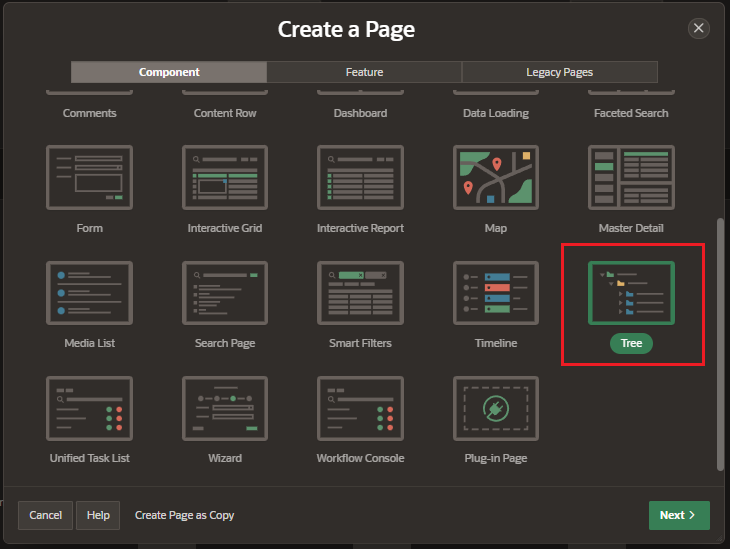
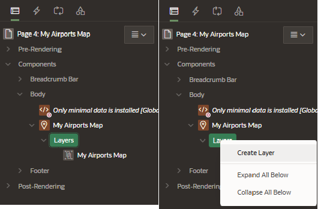

# Maps

Maps can be created to visualize location data (real coordinates) based on the data in a table.

This component allows to show a world map on the page, and add one or more Layers, each based on a table or SQL query, to show features on the map.

- free to use within your applications
- the background map is static
- comes from Oracle Elocation Service
- not require any API keys

## Create Maps

Create a new page and select the component Maps

Enter the page details:

- Pagination

  - page number
  - name
  - page mode

- Data Source;
  - table of View
  - Table / SQL Query

### Map Style

Select the type of Maps Page

- Points
- Lines
- Polygons
- Heat Map
- Extruded Polygons

### Map Attributes

Enter de Maps Attributes depending on the Map Style selected:

#### Points Maps Attributes

- Geometry Column Type
  - Geometry Column
  - Two Numeric Columns
- Geometry Column
- Tooltip Column
- Create Faceted Search Page

#### Lines

- Geometry Column
- Tooltip Column
- Create Faceted Search Page

#### Polygons

- Geometry Column
- Color Value Column
- Tooltip Column
- Create Faceted Search Page

#### Heat Map

- Geometry Column Type
  - Geometry Column
  - Two Numeric Columns
- Geometry Column
- Tooltip Column
- Create Faceted Search Page

#### Extruded Polygons

- Geometry Column
- 3D Height Value Column
- Color Value Column
- Tooltip Column
- Create Faceted Search Page

## Attributes

### Initial Position and Zoom

Determine the initial map position and zoom level for a new APEX session or after a map region Clear or Reset operation

- Type

  - Static Values
  - SQL Query: a SQL query returning values for the initial map position

  - Based on Spatial Results:
    - The map will be positioned so that layer query results are visible.
    - Note that this is not supported if GeoJSON is chosen as the layer geometry column type

- Longitud
- Latitud
- Zoom Level

## Layers

Create Layers with different Sources to display differents custom layers

### Create Layer

In the rendering Tree, click on Create Layer

### Atributes

#### Source

- Location
- Type
- Table

#### Point Objects

- Style
- Shape
- Shape Scale
