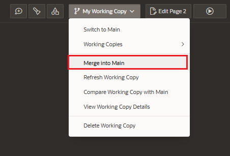

# Working Copies

Special copy of application to make changes and merge changes to main.

Allows to multiple developers work on the same workspace, same project, same page, or in a different page in parallel without hampering the changes of other developers.

Removes the necessity of locking pages.

Changes can be review by other developers.

## Create Working Copy

To access to the Working Copy Menu, we have to create a Working Copy for the application

## Working Copy Menu

- Switch to Main:
  - navigates to main application
- Working Copies
  - diplays all working copies created
- Merge into Main
  - merging changes from the working copy to main application
- Refresh Working Copy
  - import changes from main application into working copy
- Compare Working Copy with Main
  - compare changes between main copy and working copy
- View Working Copy Details
  - view and edit the working copy name and description
- Delete Working Copy
  - delete the current working copy permanently

The side bar on Application home page features links to these commonly uses options:

- Working Copy Tasks:
  - Merge to Main
  - Refresh Working Copy
  - Compare Changes
- Main Application: Include a link to the Main application

## Comparing Changes

### Between different Working Copies

When you enter in a Page that has changes done in another working copy, it will appear a warning.

Click on the warning to view the changes

Click on Diff button to check the changes

### Between Working Copy and Main

Now, you will see the list of changes

To view the changes click on Diff button

## Merge changes to main

To merge changes to main, click in the Working Copy Menu > Merge into Main

It will be display the list of changes you can merge. Select the changes to merge and click on Next button

Before merging you will provided with two options:

- Backup target app first: allows to rollback changes after merging
- Delete Working Copy after merge: can be also delete manually later

Click on Confirm button to finally merge changes.
