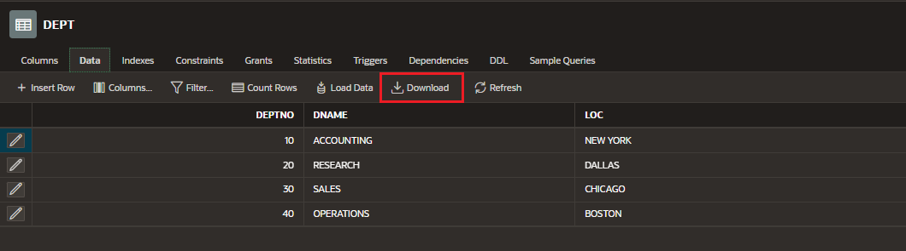
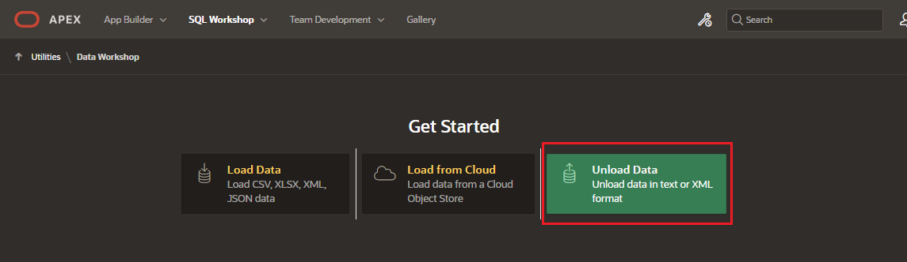
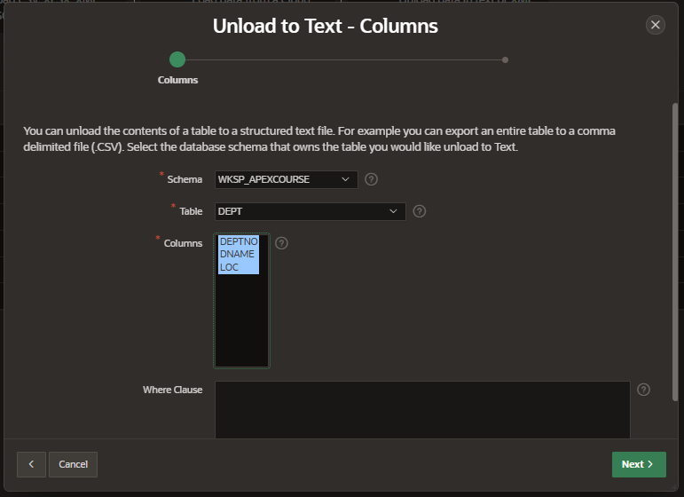
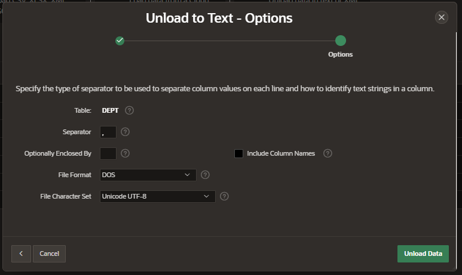
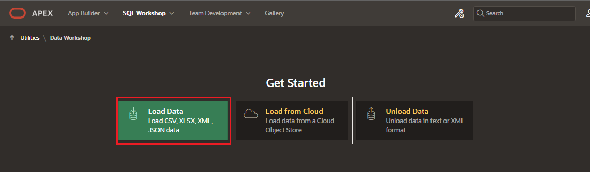
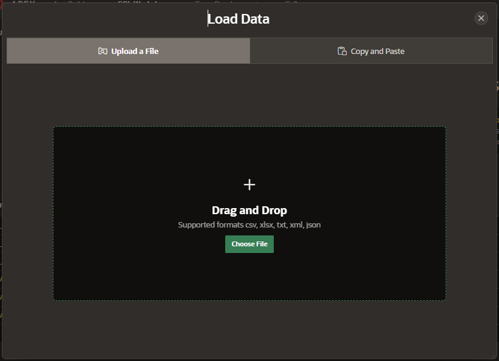
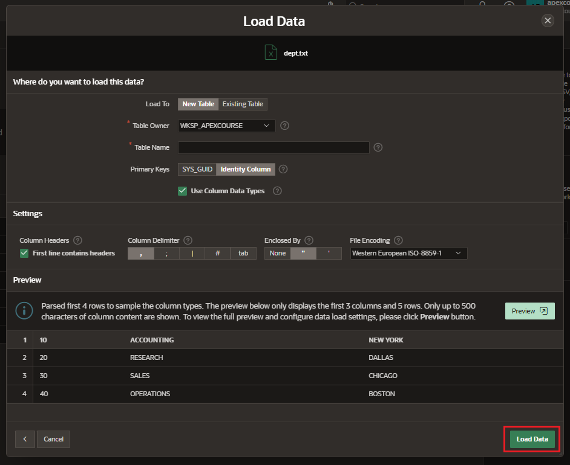

# Migrate Data

## Download Data from Database Objects Browser

Navigate to SQL Workshop > Object Browser

Go to the Database Object you want to export and click on Data Tab

Click on Download button

## Unload Data from Data Workshop

Navigate to SQL Workshop > Utilities > Data Workshop

Select the format to use for data unload

- Text Format
- XML Format

### Unload to Text

Select the Schema, Table and columns you want to unload.

Select the options

Click on Unload Data and the txt file will be downloaded

## Upload Data

Navigate to SQL Workshop > Utilities > Data Workshop

Load the file with the script

Enter the following settings

- Load to:
  - New Table
  - Existing Table
- Table Owner / Table Name
- Primary Keys
- Column Delimiter

Click on Load Data
