# Migrating

For migrating applications, we need scripts for all the database objects (DML)

Migration also involves moving data from development to production enviroment (DDL)

For migrating an application, development environment and production enviroment must have the same version of APEX running.

Update the target APEX enviroment prior to importing the application in case of version mismatch

## Generate Database Objects Scripts (DDL)

To generate the DDL Script go to the home page of the application and click on Supporting Objects

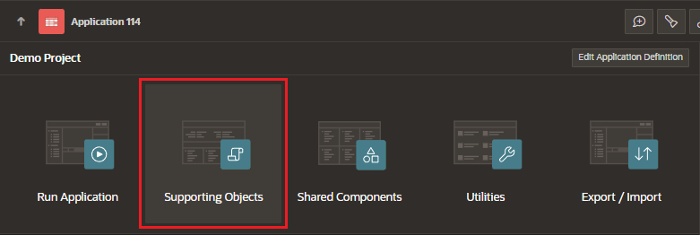

Under Installation section, click on Installation Scripts

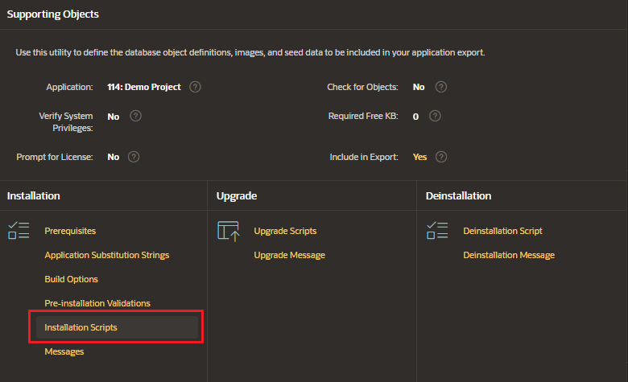

Click on Create and select Create from Database Object

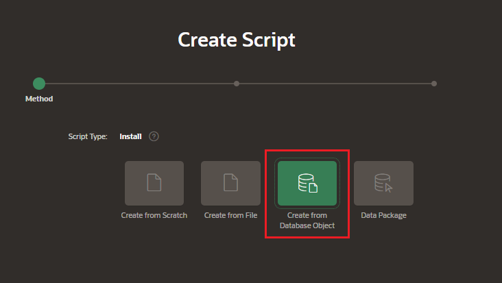

### Script Attributes

Enter the Script Attributes

- Name
- Object Type:
  - index, table, package, procedure, sequence, trigger, view

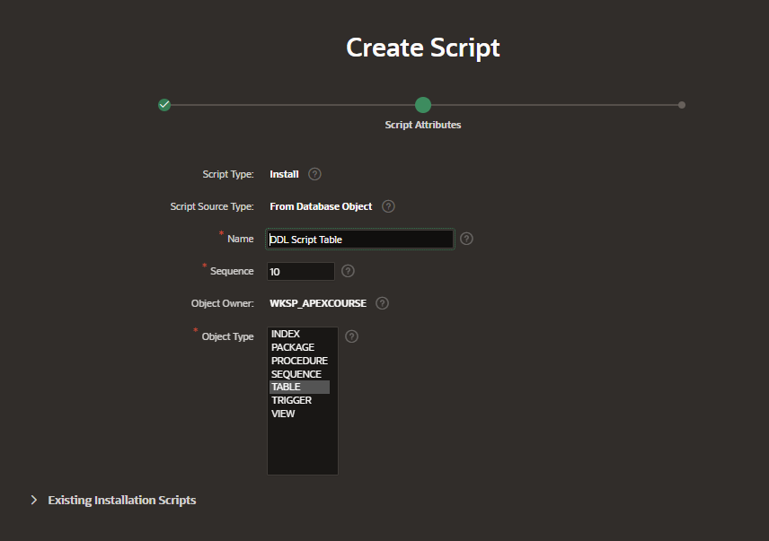

### Define Scripts

Select the object from the list

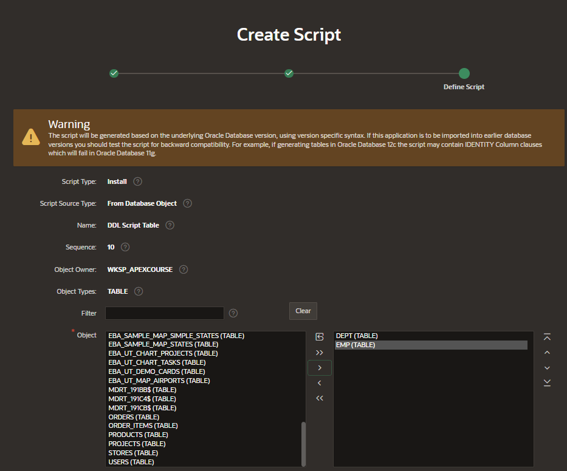

Confirm the details and click on Create

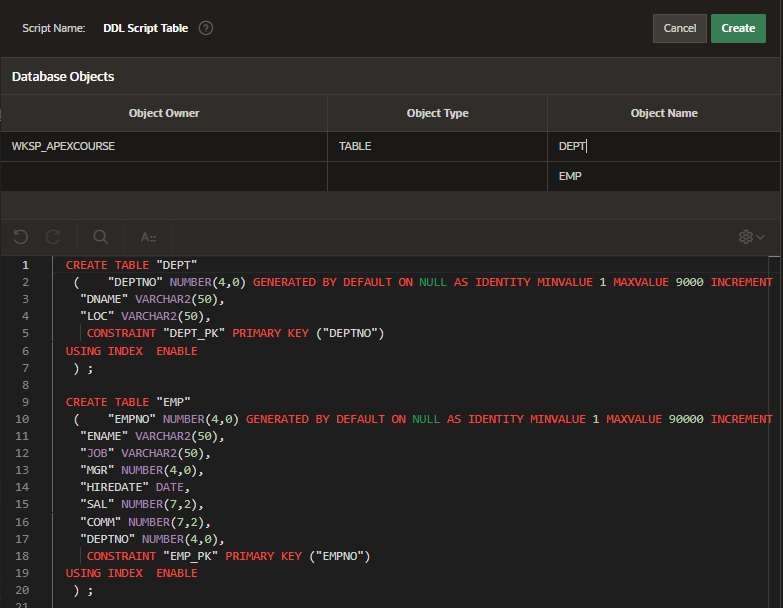

## Generate Data Package Scripts (DDL)

To generate the DDL Script go to the home page of the application and click on Supporting Objects

Under Installation section, click on Installation Scripts

Click on Create and select Create from Data Package

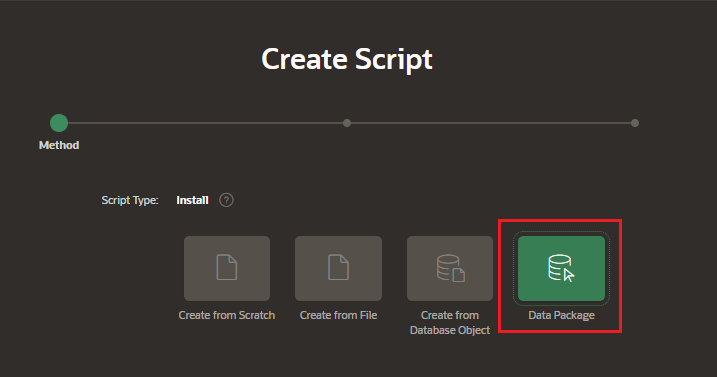

### Script Attributes

Enter the Script Attributes

- Name
- Select Tables

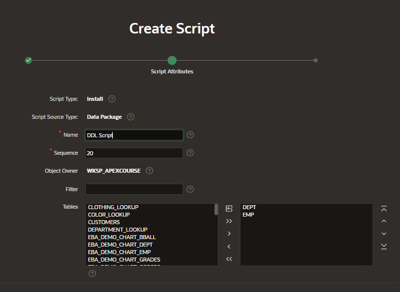

### Define Scripts

Confirm the details and click on Create

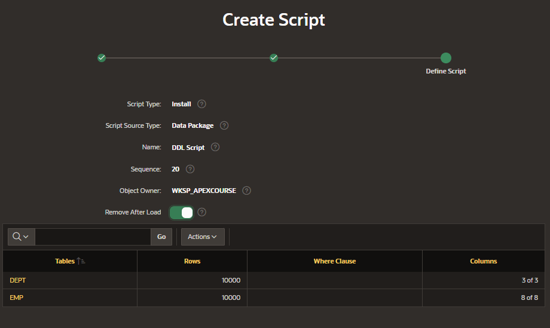

## Export Application

To export an application, navigate to the home page and click on Export/Import

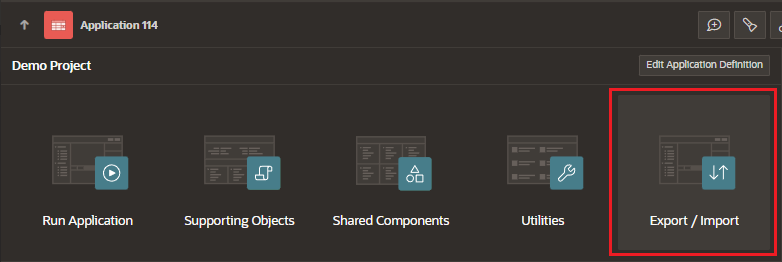

Select among the different options

- Readable Format
  - human-readable YAML version of the application meta-data
  - used to review differences between versions of an application when checked into a Version Control System
- Supporting Object Definitions
- Split into Multiple Files
  - separate files for each page, shared component, and so forth
- Public Reports

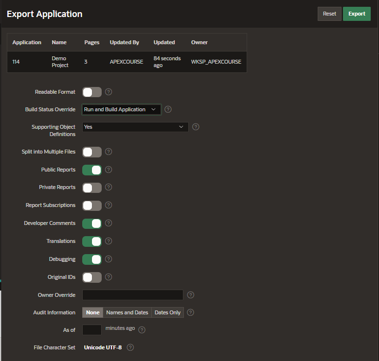

Click on Export

## Import Application

To import an application, navigate to App Builder > Import

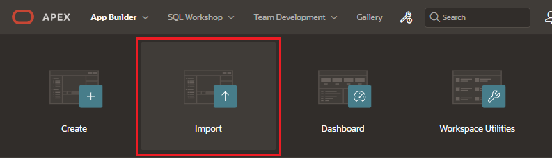

Upload the zip with the exported application

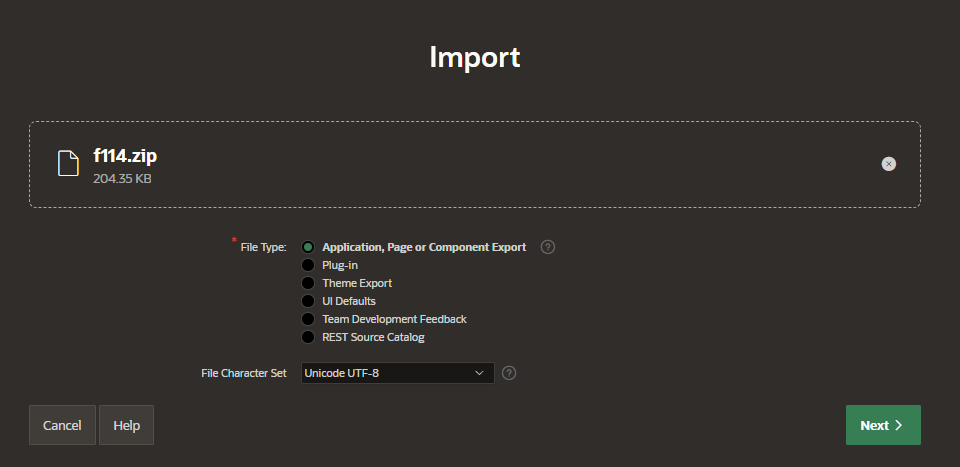

Select the installation options

- Parsing Schema
- Build Status
- Install As Application
  - Auto Assign New Application
  - Reuse Application ID From Imported Application
  - Change Application ID

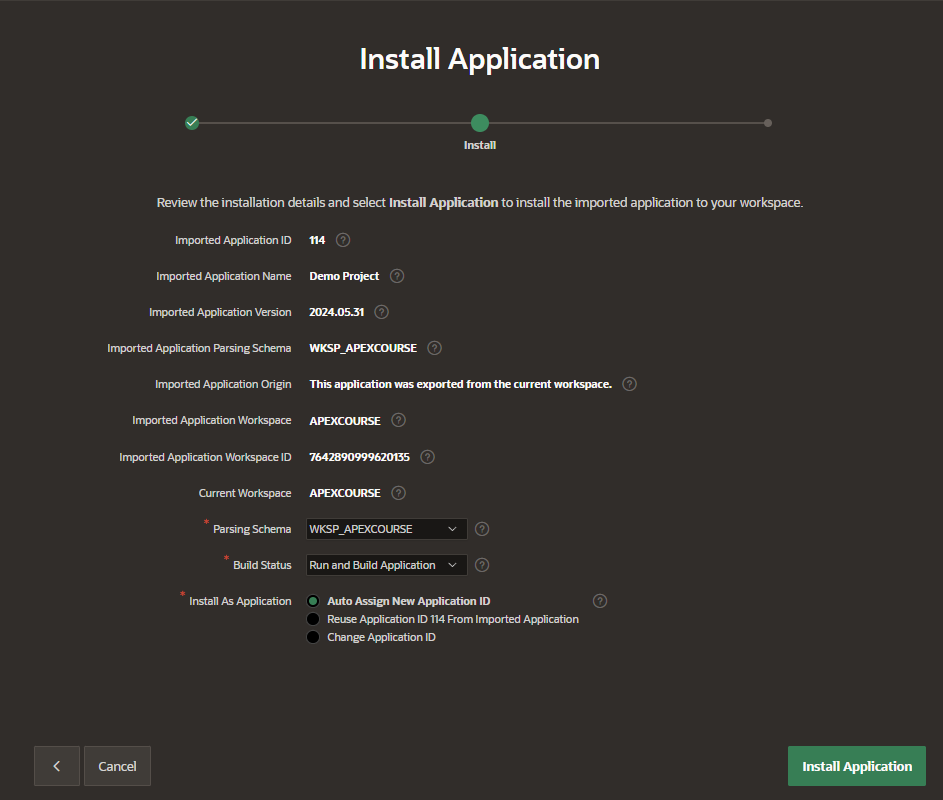

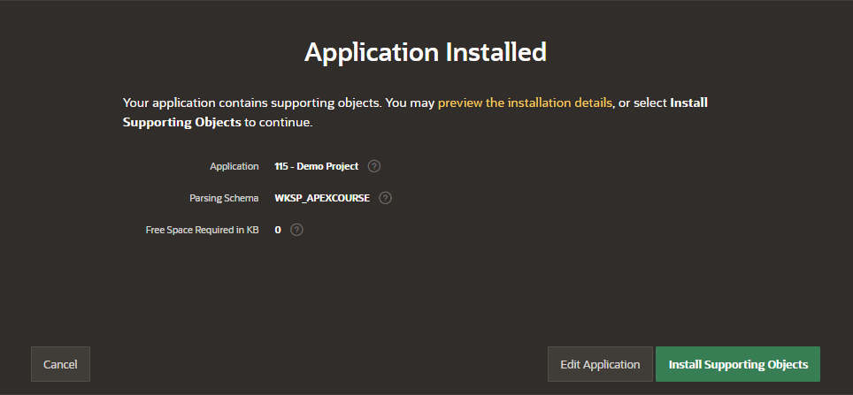
