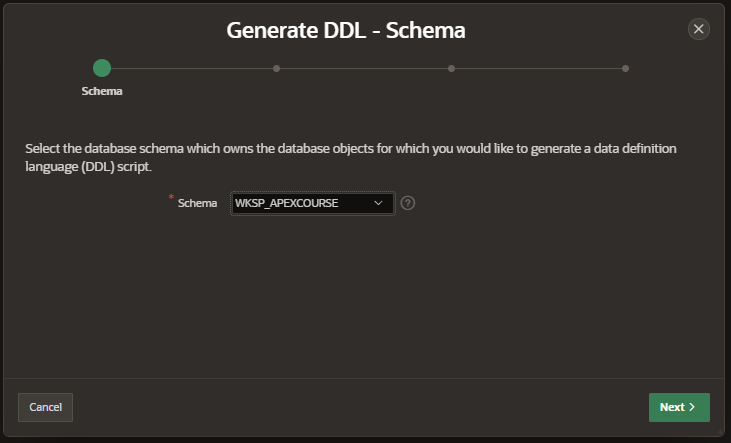
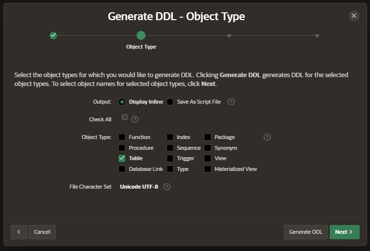
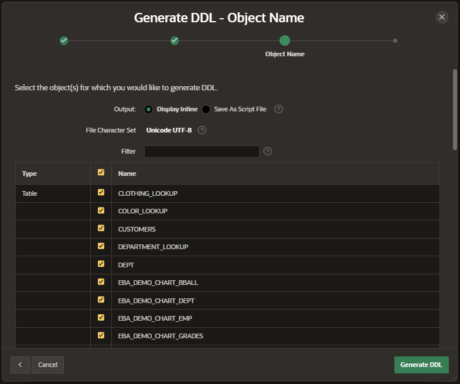
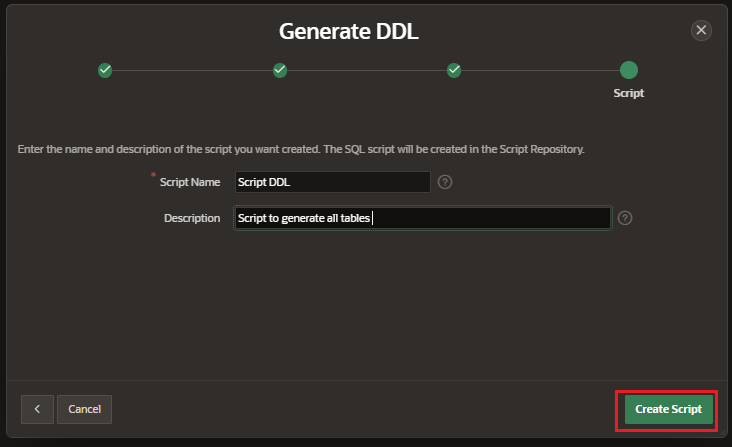
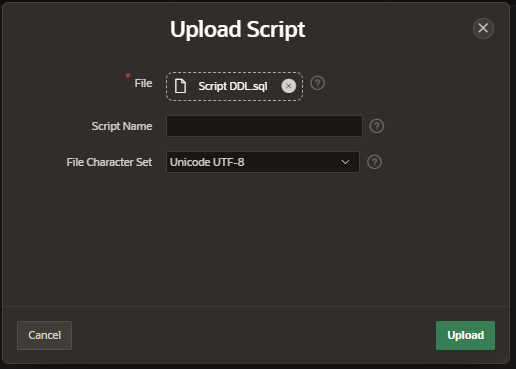
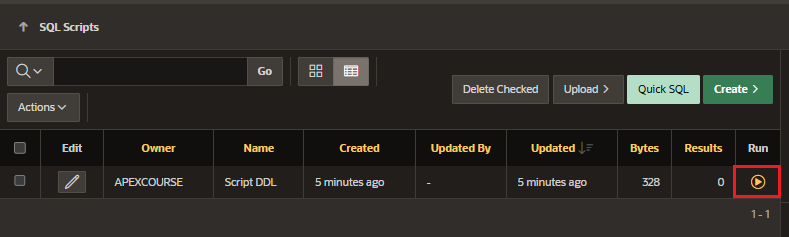

# Migrate Database Objects

We can generate the DDL script with all the Database Object of our application.

## Generate DDL Script

- SQL Workshop > Utilities > Generate DDL
- Create Script

Select the Object Types you want to migrate

Select the Database Objects you want to migrate

Enter a Name and Description for the script

Click on Generate DDL button

Download the Script to uploaded in another application

## Import DDL Script

In the application destination navigate to:

- SQL Workshop > SQL Script
- Click on Upload button

Execute the Script uploaded by clicking on Run button

