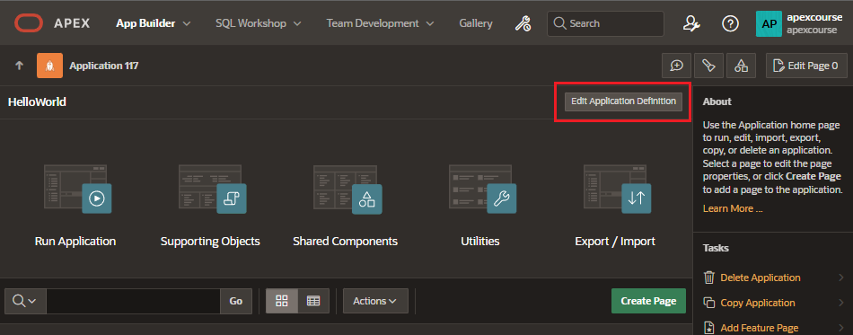

# Progressive Web App (PWA)

Progressive Web Apps (PWAs) leverage modern web APIs giving users and experience that looks and feels like a native app.

- advanced caching and improved performance
- can be installed in smartphone

## Requirements

Requirements to use the PWA feature include:

- application must be served on a secured HTTPS enviroment
- attributes that must be on:
  - Application Definition
  - Properties
  - Friendly URL

## Functionality

New functionalities are added when enabling PWA:

- ability to install app as PWA
- new navigation bar entry named Install App
- optimizes page loading speed
- install application on devices
- customizable offline page
- suuports hooks into the service worker code for fully customizable PWA experience

## Enable PWA Installability in new application

When creating a new application, under Features, you can select the enable Install Progressive Web App

## Enable PWA Installability in existing application

To enable it in an existing application

- In Application home page click on Edit Application Definiion
  - General Tab:
    - Friendly URLs: must be enabled
  - Progressive Web App:
    - Enable Progressive Web App

