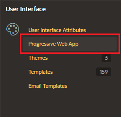

# Screenshots and Descriptions

Screenshots ar visual depiction of your application screens. To incentivize users to install the application.

Descriptions explains what the application does

## Managing Screenshots

- App Builder > Shared Components > Progressive Web App

- General Tab:

  - Progressive Web App: enable
  - Installable: enable

- Installability
  - Add Description: enter a short description
  - Add Screenshot: description and upload image

## Meta Tags

Data that helps other system summarize a web page's content

In Page Designer check that you page is public (no authentication)

In Attributes

- Advanced:
  - Enabled Meta tags: enable

In the Rendering Tree will appear a new section

- Add your Meta Tag name and value pairs
