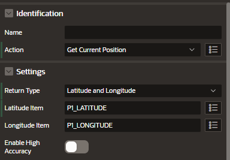

# Geolocation

You can use the Get Current Position dynamic action to fetch the device's current location.

## Return Types

- Latitude and longitude
  ```
  P1_LATITUDE: 20.71932312
  P1_LONGITUDE: -103.343433
  ```
- GeoJSON object, into page items

```json
{
  "latitude": 20.71932312,
  "longitude": -103.343433,
  "altitude": null,
  "accuracy": 16.452,
  "altitudeAcurracy": null,
  "heading": null,
  "speed": null
}
```

- Custom Javascript function can receive a Geolocation object as a paremeter

```js
function (position, event) {
    apex.debug.log(position, event);
}
```

# Configure

In Page Designer add the following items:

- P1_LATITUDE
- P1_LONGITUDE
- Button

Add a Dynamic Action to the button

- Action: Get Current Position
- Return Type: Latitude and Longitude
- Latitud Item: P1_LATITUDE
- Longitued Item: P1_LONGITUDE
  
