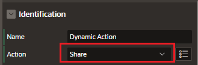
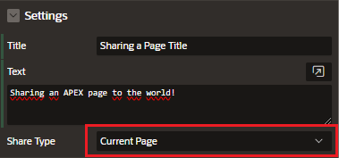

# Web Share

Share Dynamic Actions lets you share data from your APEX application.

In Page Designer, under a Dynamic Action change Action by Share

### Settings

- Title
- Text
- Share Type:

  - Current Page: Share the current page that the user is viewing

  - URL: share a page in this application, a page from another application, or a custom URL.

  - File(s): Share one or multiple files, statically defined or from a SQL query

