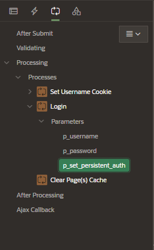

# Peristent Authentication

Enables devlopers to use a bult-in API to let users choose to re-login to an application without having to provide credentials

- increaes users engagement
- secured by default

## Enabling Persistent Auth

To enable Persistent Auth at Instance Level

- sign in to your APEX instance as admin

- Manage Instance > Instance Settings > Security

  - Allow Persistent Auth: Yes
  - Lifetime: set a value of days


## Setting Persistent Auth in the Application

### Page Item

In the login page, create a Page Item that will be the "Remember me" check.

Set the Server-Side Condition as Expression and enter the following code:

This condition evaluates if the persistent authentication is enabled, and if it is this page item is displayed

```sql
apex_authentication.persistent_auth_enabled
```


### Processes

Go to the process Login and edit the properites of the parameter `p_set_persistent_auth`

- Type: Item
- Item: selcet the persistent item created




