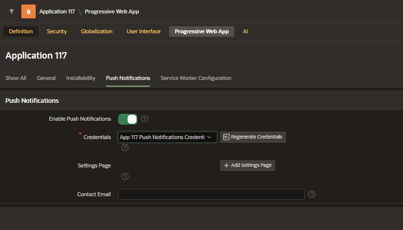
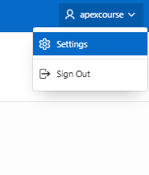
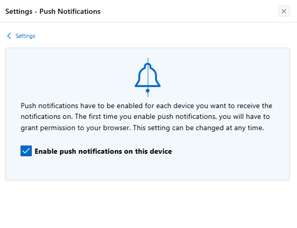
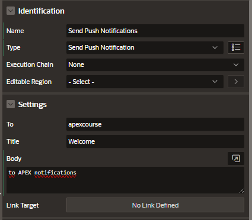

# Push Notifications

Enables real-time communication on user-device

- Declarative, no-code notification via Native Page process
- APEX_PWA Api to integrate sending notifications into their exisiting workflow

## Enabling Push Notifications on New Application

When creating a new application, under Features, you can select the enable Install Push Notification

## Enabling Push Notifications on Existing Application

- App Builder > Shared Components > Progressive Web App
- Push Notification Tab
  - Enable Push: Yes
  - Credentials



## Subscribing Devices

To provide consent to receive notifications on your device, after you run the application, you need to:

- top navigation bar username > Settings



- set on the Push notifications option
- check Enable Push Notifications on this device checkbox



## Sending Notifications

### Using Page Process

- Create Processs of type Send Push Notification
- Settings
  - To: username
  - Title
  - Body



### Using API

```sql
BEGIN
    APEX_PWA.send_push_notification(
        p_application_id => 100,
        p_user_name => 'SMITH',
        p_title => 'Notification Title',
        p_body => 'Notification Body'
    )
END;
```

### APEX Views

To identify the users who have subscribed to the feature in order to use the page process or the API meaningfully.

#### apex_appl_push_subscriptions

The apex_appl_push_subscriptions view lists all users who have opted in to receive your notifications, making it easy to target your messages to all your subscribers and Send a notification using the API. You could find an example in Send using API section above.

```sql
select * from apex_appl_push_subscriptions;
```

#### apex_push_notifications_queue

The apex_push_notifications_queue view, provides the notification records that are pending or have encountered errors during the sending process. This information useful for troubleshooting issues and ensuring the successful delivery of your push notifications.

```sql
select * from apex_push_notifications_queue;
```

### Push Queue

apex_pwa.push_queue is an API designed to trigger sending pending push notifications in the queue.

When sending a push notification, it is in fact simply added to a queue, with the push queue mechanism responsible for dispatching these notifications.

In case of a failure, the queue entry is updated with an error message and can be located in the apex_push_notifications_queue view.

Upon successful delivery, the entry is removed from the queue. Although a background job is set to process the queue every 2 minutes by default, developers can expedite the delivery using the apex_pwa.push_queue API.

```SQL
begin
    apex_pwa.push_queue;
end;
```

## Receiving Notifications

- Only opted devices will receive
- Notification are sent even then the device is idle
- Simplifies navigation and fosters engagement

## Deploying Application

For security purposes, APEX applications using push notifications require a key-pair credentials. Since credentials are not exported with an application during deployment, it's necessary to regenerate the key-pair credentials on the destination environment for push notifications to work.

It's only necessary to regenerate the credentials the first time your application is being deployed. Any subsequent deployments don't need to regenerate their key-pair credentials.

To regenerate the credentials for an application push notifications, you can either:

- Go to Shared Components > Progressive Web App > Push Notifications > Regenerate Credentials
- Use the API to regenerate push credentials for the newly deployed application:

```sql
begin
    apex_pwa.generate_push_credentials (
        p_application_id => :APP_ID );
end;
```
