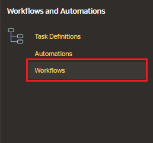
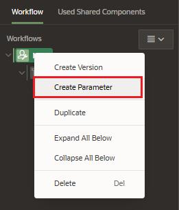
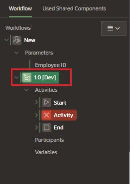
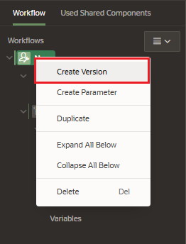
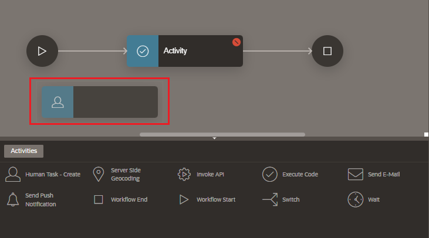
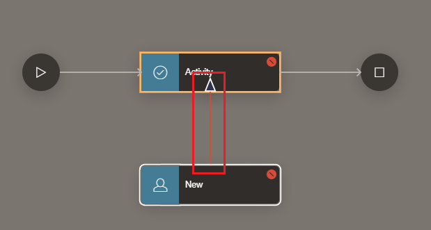
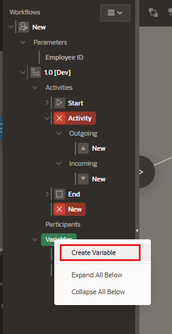
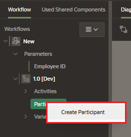

# Workflow Creation

In Shared Components, under Workflows and Automations navigate to Workflows

Click on Create button

## Parameters

In the Workflow Navigation Tree, right click in the root to create parameters

Select the parameter properties in the right property pane

- Identification
  - Static ID
- Label
- Variable
  - Data Type
- Value
  - Required
  - Default Value

## Versions

There can be only one Version in Development. By default, a Version is created.

In the Workflow Navigation Tree, right click in the root to create a version

Select the parameter properties in the right property pane

- Identification
  - Workflow Version
- Settings
  - State: In development

## Activities

You can create Activities in the Workflow Navigation Tree, under Activities node right click or you can drag and drop an activity from the Gallery

## Conections

You can also create Connections for the Activities in the Workflow Navigation Tree, under Activities node right click or you use the Diagram Builder to connect activities.

To modify a Connection, select the properties in the right property pane

- Identification
  - Name
  - Type
- Activity
  - From: from activity
  - To: to activity

## Variables

You can also create Variables in the Workflow Navigation Tree, under Variables node.

Select the parameter properties in the right property pane

- Identification
  - Static ID
- Label
- Variable
  - Data Type
- Value
  - Type
  - Value

## Participants

In the Workflow Navigation Tree, right click in the root to create a Participant

- Identification
  - Name
  - Type
    - Workflow Owner
    - Workflow Administrator
- Value
  - Type
  - Value
