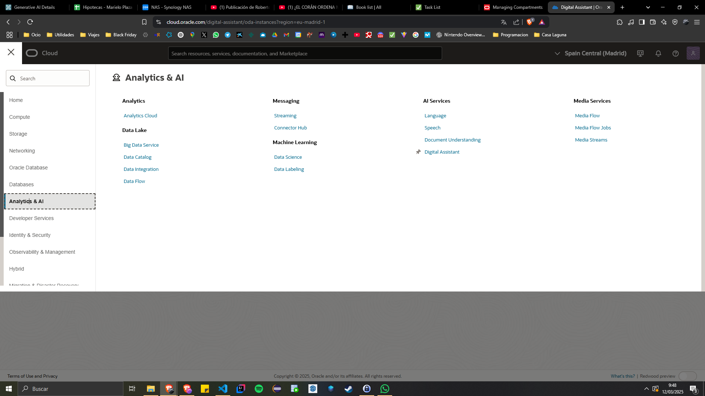

# Generative AI Service

An abstraction to popular commercial Generative AI products like OCI Generative AI, Open AI, and Cohere.

- authenticates using Web Credentials in Oracle APEX

- used by App Builder, AI Assistant, AI Dynamic Actions and APEX_AI PL/SQL API

- can be enabled/disabled on APEX Instance and Workspace levels

## Provider

Choose your preferred AI Provider

### Open AI

- Bearer Authentication
- Chat Completions endpoint

### OCI Generative AI Service

- OCI Native Authentication
- Chat Models

### Cohere

- Bearer Authentication
- Chat enpoint

## APEX_AI API

Public PL/SQL API in Package APEX_AI

- models 'chat' operation of popular Generative AI REST Services

- user internally by the Chat Widget

## Use Cases

- Text to SQL
- Prompt Based App Creation
- AI Assistant

# OCI Generative AI Service

## Create Digital Assistant Instances

Go to the Oracle Cloud Palatform https://cloud.oracle.com/

- In the navigate Menu go to Analytics & AI
- AI Services > Digital Assistant
- Click Create digital assistant instance
- Copy the Compartment ID for the next steps

## Create API Key

- Profile > User Settings
- Resources > API keys
- Click on Add API key button

## Configurate

App Builder > Workspace Utilities > Generative AI

Click on Create

Enter the details:

- Identification

  - AI Provider
  - Name
  - Static ID

- OCI Generative AI

  - Compartment ID: copy from Digitial Assistant Instance
  - Region: there is only one available
  - Model ID

- Settings

  - Used By App Builder: indicates whether this Generative AI Service will be used by App Builder
  - Based URL

- Credentials:
  - Credential
  - OCI User ID
  - OCI Private Key

# Open AI

App Builder > Workspace Utilities > Generative AI

Click on Create

Enter the details:

- Identification

  - AI Provider
  - Name
  - Static ID

- Settings

  - Used By App Builder: indicates whether this Generative AI Service will be used by App Builder
  - Based URL

- Credentials:
  - Credential
  - API Key
