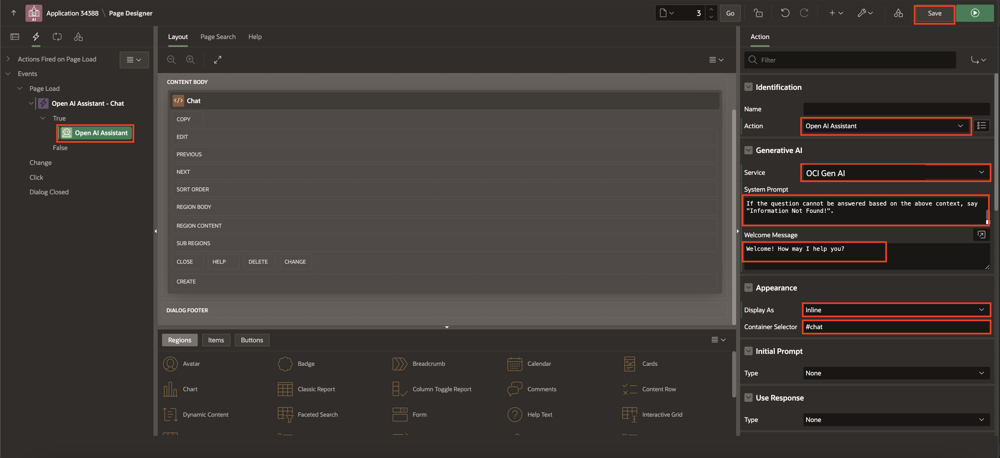

# AI Assistant Dynamic Actions

From the Rendering Tree, navigate to the Dynamic Actions tab. Right-click Page Load and select Create Dynamic Action.

For the TRUE action, in the Property Editor:

- Identification

  - Name
  - Action: Open AI Assistance

- Generative IA
  - Service
  - System prompt
  - Welcome message

