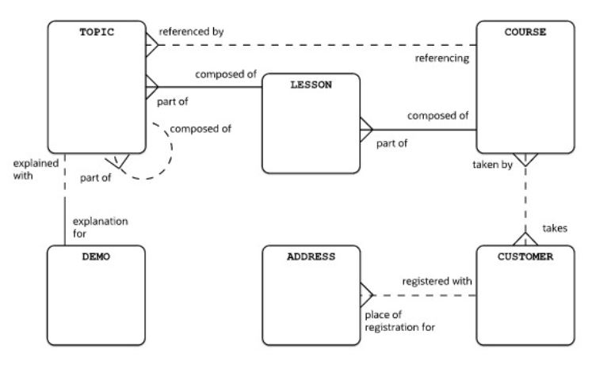

# Relationships examples

- Each customer may take one or more courses.
  Each course can be taken by one or more customers

- Each customer may be registered with one or more addresses
  Each address may be a place of registration for one and only one customer

- Each course must be composed of one or more lessons
  Each lesson must be a part of one and only one course

- Each lesson must be composed of one or more topics
  Each topic must be a part of one and only one lesson

- Each course may be referencing one or more topics
  Each topic may be referenced by one and only one course

- Each topic may be composed of one or more topics
  Each topic may be a part of one and only one topic

- Each topic may be explained with one and only one demo
  Each demo must be an explanation for one and only one topic
