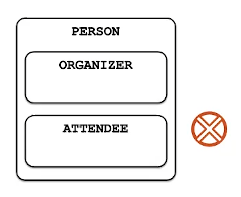
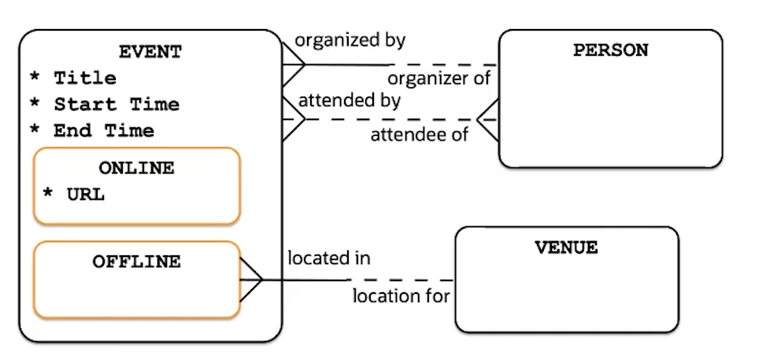

# Supertype-Subtype entities

They are two or more mutually exclusive variants (sub-types) of the same entity (super-type)

- The supertype entity holds common attributes and relationships
- Subtype entities may contain specific attributes and relationships
- Each _EVENT_ must be either _ONLINE_ or _OFFLINE_

Do not model roles as subtypes

- Represent different states of the same instance of the entity, not difference instances
- Often not mutually exclusive
- Should be modeled as relationships



## Example

_EVENT_ must be either _ONLINE_ or _OFFLINE_



You can model any number of subtypes and subtype levels with s given entity. However, practically, this is not a very common construct. Information requirements usually call for more flexibility than the subtype-supertype construct allows.

A given entity instance can often be used in different ways and contexts, which is best modeled by relationships that this entity has with other entities. On the other hand, subtypes always imply that the model represents different entity instance that are never the same or overlap.

For example, the model that describes an event as either online or offline does not allow an event that is both, which could be considered fine, or too restrictive from the business rules point of view.

You can think of subtypes entities as a way to model if certain attributes and reletionships are mandatory, but only in certain cases. For example, modeling subtype-supertype entities is an appropriate solution for a business rule that states that a venue must be assigned to each office event and that a URL must be assigned to each online event, and that the same event can never be both. Notice that both the relationship and the attribute are described as mandatory, but only in these specific cases. Without subtypes, such attributes and relationships would have to be made optional, because their values are only appropriate when the event is of a particular type.

Your company holds events in both online and offline format, although a specific event is either one or the other and cannot be both. Events have a descriptive title, a time when they begin, and a time when they end. Both times are known at the time the event is created.

Online events differ from offline events in that they have a URL that is used to connect to the event. Online events are held at a venue, and the venue could host multiple events.

A person organizes events. A person can organize multiple events, and they can attend different events. An event could be attended by multiple people.

# Implementation

## Single Table Subtype-Supertype

```sql
CREATE TABLE EVENTS (
    ID INTEGER NOT NULL,
    START_TIME DATE NOT NULL,
    EVE_TYPE CHAR(7) NOT NULL,
    URL VARCHAR(255),
    VEN_ID INTEGER,

    CONSTRAINT EVE_PK PRIMARY KEY (ID),
    CONSTRAINT EVE_VEN_FK FOREIGN KEY (VEN_ID)
    REFERENCES VENUES (ID)

    -- Check constraints
    CONSTRAINT EVE_TYPE_CH CHECK
        (EVE_TYPE IS 'ONLINE' AND URL IS NOT NULL AND VEN_ID IS NULL
        OR
        EVE_TYPE IS 'OFFLINE' AND URL IS NULL AND VEN_ID IS NOT NULL)
)
```

```sql
CREATE TABLE VENUES (
    ID INTEGER NOT NULL,
    CONSTRAINT VEN_PK PRIMARY KEY (VEN_ID)
)
```

## Joined Subtype-Supertype

The joined table approach converts the supertype-subtype design into an arc design.

- A table per subtype
- A table for a supertype containing foreign keys to a table representing subtypes
- Foreign keys for subtypes are implemented as an arc

```sql
CREATE TABLE EVENTS (
    ID INTEGER NOT NULL,
    START_TIME DATE NOT NULL,
    ONL_ID INTEGER,
    OFF_ID INTEGER,

    CONSTRAINT EVE_PK PRIMARY KEY (ID),
    CONSTRAINT EVE_ONL_FK FOREIGN KEY (ONL_ID)
    REFERENCES ONLINE (ID)

     -- Check constraints
    CONSTRAINT ONL_OFF_CH CHECK
        (ONL_ID IS NOT NULL AND OFF_ID IS NULL
        OR
        ONL_ID IS NULL AND OFF_ID IS NOT NULL)
)
```

```sql
CREATE TABLE ONLINE (
    ID INTEGER NOT NULL,
    URL VARCHAR(255) NOT NULL,
    CONSTRAINT ONL_PK PRIMARY KEY (ID)
)
```

```sql
CREATE TABLE OFFLINE (
    ID INTEGER NOT NULL,
    VEN_ID INTEGER NOT NULL,
    CONSTRAINT OFF_PK PRIMARY KEY (ID)
)
```

### Single table vs Joined implementation

- Single table is less compact in terms of storage
- Joined implemantation has performance issues when joining data from multiples tables

## Table Per Subtype

A table per subtype, with duplicated supertype columns.

This is mostly theorical construc because of its many flaws such as:

- Extensive duplication of data
- The difficulty, if not impossible, of implementing any supertype integrity checks
- Significant performance implications when joining data from multiple tables

```sql
CREATE TABLE ONLINE (
    ID INTEGER NOT NULL,
    START_TIME DATE NOT NULL,
    URL VARCHAR(255) NOT NULL

    CONSTRAINT ONL_PK PRIMARY KEY (ID),
)
```

```sql
CREATE TABLE OFFLINE (
    ID INTEGER NOT NULL,
    START_TIME DATE NOT NULL,
    VEN_ID INTEGER NOT NULL

    CONSTRAINT OFF_PK PRIMARY KEY (ID),
)
```

The table per subtype implementation is generally a bad idea unless:

- Supertype has almost no attributes and relationships
- Subtype has different unique identifiers and no common identity
