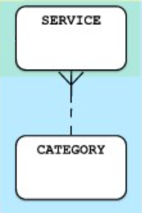

# Classification Pattern

This is again a _1:M_ relationship, but it is much less tightly coupled compared to the master detail.

In this example, _Category_ can potentially exist without any services actually referencing it, and it is also more plausible that a service can be reassigned to a different category than an _Item_ reassigned to a different _Order_, which means that classification relationships are usually transferable as classifications may change over time.

### Typecal classification-type relationship names:

- Classified by
- Grouped by
- Assigned to
- (Exists) In

## Example



### CATEGORY-SERVICE

#### Entity Table: Service

```sql
CREATE TABLE Products (
    ProductID INT PRIMARY KEY,
    ProductName VARCHAR(100) NOT NULL,
    Price DECIMAL(10, 2) NOT NULL
);
```

#### Classification Table: Category

```sql
CREATE TABLE Categories (
    CategoryID INT PRIMARY KEY,
    CategoryName VARCHAR(100) NOT NULL
);
```

### Association Table: ProductCategories

For many-to-many relationships

```sql
CREATE TABLE ProductCategories (
    ProductID INT NOT NULL,
    CategoryID INT NOT NULL,
    PRIMARY KEY (ProductID, CategoryID),
    FOREIGN KEY (ProductID) REFERENCES Products(ProductID),
    FOREIGN KEY (CategoryID) REFERENCES Categories(CategoryID)
);
```
