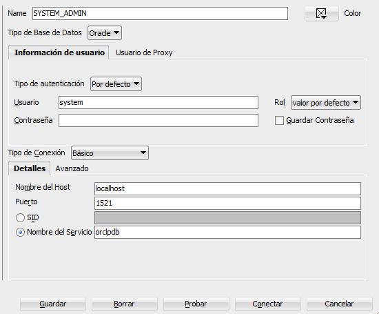
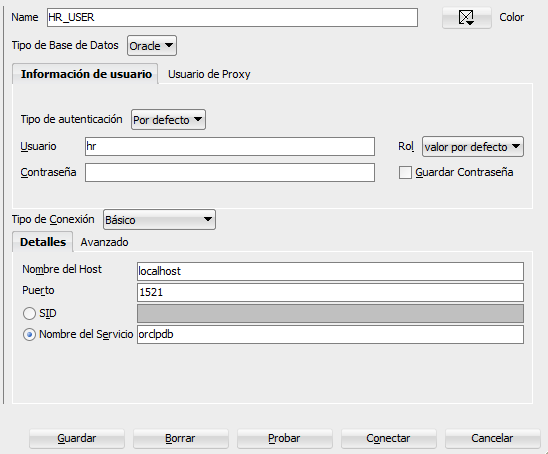

# Create HR Schema

## Download the HR Schema scripts

Descargar los script para la creación el HR Schema.

- Version 21c: https://github.com/oracle-samples/db-sample-schemas/releases/tag/v21.1

## Copy files to application

Copiamos todos los script de la carpeta _HUMAN_RESOURCES_ en la ruta donde tengamos instalado la base de datos Oracle.

- _hr_analz.sql_
- _hr_code.sql_
- _hr_comnt.sql_
- _hr_cre.sql_
- _hr_dn_c.sql_
- _hr_dn_d.sql_
- _hr_drop.sql_
- _hr_idx.sql_
- _hr_main.sql_
- _hr_popul.sql_

Dentro lo colocamos en la siguiente carpeta:

```
C:\app\demo\schema\human_resources
```

## Execute scripts

Desde una conexion como Administrador ejecutamos el script _hr_main.sql_, que creara el schema y los usuarios.



```sql
@ C:\Users\[PATH_APP]\demo\schema\human_resources\hr_main.sql
```

Una vez creado el usuario, podremos conectarnos al HR Schema para lanzar el resto de scripts.



Desde la conexion HR_USER ejecutamos el resto de ficheros

```sql
@ C:\Users\[PATH_APP]\demo\schema\human_resources\hr_cre.sql
@ C:\Users\[PATH_APP]\demo\schema\human_resources\hr_popul.sql
@ C:\Users\[PATH_APP]\demo\schema\human_resources\hr_idx.sql
@ C:\Users\[PATH_APP]\demo\schema\human_resources\hr_code.sql
@ C:\Users\[PATH_APP]\demo\schema\human_resources\hr_comnt.sql
@ C:\Users\[PATH_APP]\demo\schema\human_resources\hr_analz.sql
```

## Browse database objects

Al refrescar ya deberian de salir las tablas, procedimientos, etc.
