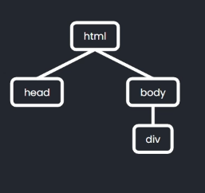
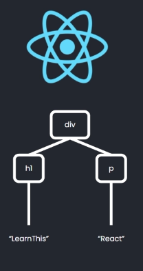
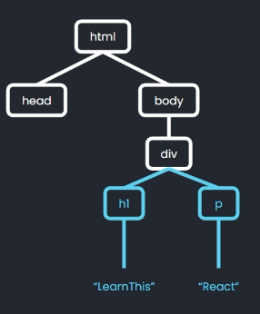

# Virtual DOM (VDOM)

Esctructura de datos que React crea y utiliza para representar y manipular con el DOM con mayor facilidad.

Se trata de una versión simplificada del DOM, que al igual que este es una estructura de nodos que cumplen las mismas reglas padre/hijo/hermano.

## DOM vs VDOM

- VDOM no almacena todo el DOM (descarta _html_, _head_ y _body_ ya que nunca cambian).
- Los nodos del VDOM son objetos mucho mas simples, solo almacenan las propiedaes que estan actualmente en uso.
- VDOM no es una estructura circular como lo es el DOM, ya que solo podremos navegar hacia los hijos. VDOM Es una estructura JSON

## Nodos del VDOM

- Diferencias en las referencias dentro de un nodo a otros nodos:
  - Un nodo no conoce quien es su padre
  - Un nodo no conoce quienes son sus hermanos
  - Un nodo solo conoce a sus hijos

# Proceso carga con el VDOM

Cuando se carga una web con Reactjs ocurre lo siguiente:

1.  En un inicio, en el navegador, la página estará vacía. El DOM unicamente tiene las etiquetas mínimas para funcionar.

    

2.  React crea el virtal DOM con todo sus nodos.

    

3.  Se traslada todo el contenido del VDOM al DOM y la página estará lista para el usuario.

    

Cuando el usuario produce una acción que provoca un cambio en la interfaz pasa lo siguiente:

1.  Se crea la nueva version de ese nodo del VDOM en el que se ha producido el cambio.

    Este nodo puede sufrir mas de un cambio antes de llegar a un estado final.

2.  Calcular la diferencia entre esta nueva version del nodo y la actual en el VDOM.

3.  Se aplican los cambios sobre el VDOM, generando una nueva versión el mismo que ya no coincide con el DOM original.

4.  Utilizar un algoritmo muy optimizado para calcular cual es la forma mas eficiente de trasladar estos cambios al DOM real.

Sin el VDOM, hubieramos generado un renderizado del nodo por cada modificacion intermedia realizada. Pero gracias al VDOM, hemos provocado solo un renderizado, el mínimo necesario.
