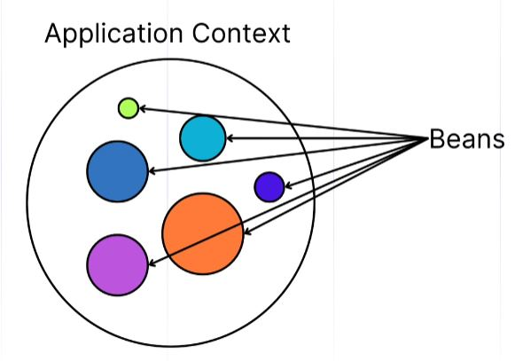

# Inversion of Control (IoC)

_IoC_ is a design principle where the control of creating and managing objects is transferred from the application code to a separate component, container or framework (eg. spring).

This principle inverts the control:

- you don’t call the dependencies
- Spring gives them to you

### Benefits of IoC

- Loose coupling
  - reduces dependency between components
  - easier to manage and evolve application
- Easier to test
  - by injecting mock implementation
- More maintainable and modular
  - dependency injection encourages modular applications development
- Reusable and replaceable components

# Dependency Injection (DI)

To implement IoC it neccesary to use a technique called Dependency Injection (DI).

Dependency Injection is a design pattern where an object receives the objects it depends on, instead of creating them itself.

Since the object is not responsible for creating its own dependencies, dependency injection reduces coupling between components.

# Spring IoC Container

The IoC Container is the core of the Spring Framework.

It is responsible for:

- Instantiating objects (beans)
- Configuring them
- Managing their complete lifecycle
- Injecting dependencies automatically

## Dependencies Injection Types

In Spring exists 3 types of injection

#### Constructor Injection

Dependency is injected in the constructor

- recommended option
- cleaner and safe

```java
@Component
public class Car {
    private final Engine engine;

    @Autowired
    public Car(Engine engine) {
        this.engine = engine;
    }
}
```

#### Setter Injection

Dependency is injected in the constructor

```java
@Component
public class Car {
    private Engine engine;

    @Autowired
    public void setEngine(Engine engine) {
        this.engine = engine;
    }
}
```

#### Field Injection

Injection directly on the class fields

- code injection is easy
- but harder to test/mock

```java
@Component
public class Car {
    @Autowired
    private Engine engine;
}
```

## Container Types

### BeanFactory

Basic container functionality

- suitable for simple applications
- lazily initializes beans (only when needed)

### ApplicationContext

A more advanced container built on top of _BeanFactory_

- Use in most modern apps
- Internationalization (i18n)
- Event publishing
- Application lifecycle callbacks
- Environment abstraction (e.g., profiles, properties)
- Bean post-processors and factory beans


